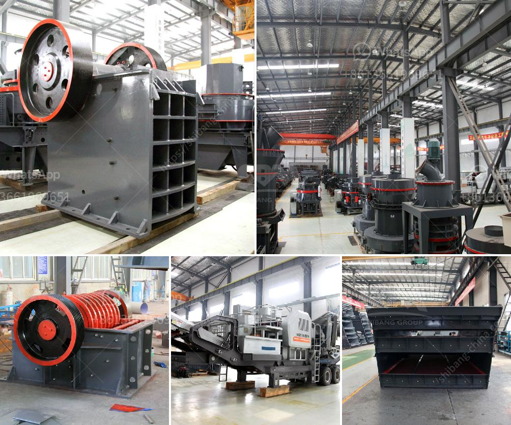

<h3>100 tph cobble crushing plant</h3>
The popularity of cobblestones in construction and landscaping has skyrocketed over the years. These round stones, which are naturally weathered and water-worn, add a charming and rustic touch to any project. With their diverse range of colors and sizes, cobblestones have become a preferred choice for homeowners and contractors alike. To meet the increasing demand for cobblestones, manufacturers have developed the 100 tph cobble crushing plant.

The cobble crushing plant is specifically designed for cobble, which is a popular stone used for landscaping, construction, and pavement. Due to its unique shape and hardness, cobblestones provide high resistance to wear and tear, making them suitable for outdoor projects. The 100 tph cobble crushing plant is an excellent choice for the producer who requires a flexible and highly portable plant that can cater to varying production needs.

This plant consists of a vibrating feeder, primary jaw crusher, cone crusher, vibrating screen, and two deck screens. The cone crusher uses hydraulic pressure to adjust the size of the cobblestones, ensuring a uniform and consistent product. The vibrating screen and two deck screens separate the crushed cobblestones into different sizes, meeting the specific requirements of different projects.

One of the key advantages of the 100 tph cobble crushing plant is its mobility. The plant can be easily transported to different sites, allowing producers to crush cobblestones on location, reducing transportation costs and environmental impact. Additionally, the plant's compact design minimizes the space required for installation, making it suitable for both large-scale operations and smaller projects.

In terms of productivity, the 100 tph cobble crushing plant offers impressive performance. With a capacity of 100 tons per hour, the plant can efficiently process large quantities of cobblestones. This high production rate ensures that projects are completed on time, without any delays.

The 100 tph cobble crushing plant also prioritizes safety. The plant is equipped with advanced safety features, including emergency stops, guards, and a user-friendly control system. These safety measures ensure that the plant operates smoothly and reduces the risk of accidents.

Furthermore, the 100 tph cobble crushing plant is designed with sustainability in mind. The plant incorporates energy-saving technologies, such as the use of efficient motors and intelligent control systems. This reduces energy consumption and lowers operational costs, contributing to a smaller carbon footprint.

In conclusion, the 100 tph cobble crushing plant is a versatile and efficient option for crushing cobblestones. Its mobility, productivity, and sustainability make it a valuable asset for any construction or landscaping project. Whether it's a small residential project or a large-scale commercial venture, this plant can meet the production needs while ensuring high-quality and uniform crushed cobblestones.
<h3>Contact us</h3><ul><li><strong>Whatsapp:&nbsp;<a href="https://wa.me/8613661969651">+8613661969651</a></strong></li><li><a href="https://swt.shibang-china.com/?git&amp;zhl&amp;100 tph cobble crushing plant"><strong>Online Service(chat now)</strong></a></li></ul><h3>Related</h3><ul><li><a href='propel stone crusher.md'>propel stone crusher</a></li><li><a href='hydraulic driven track mobile plant.md'>hydraulic driven track mobile plant</a></li><li><a href='used pioneer jaw crusher.md'>used pioneer jaw crusher</a></li><li><a href='xzm ultrafine grinding mill.md'>xzm ultrafine grinding mill</a></li><li><a href='grinding mill installation operation.md'>grinding mill installation operation</a></li></ul>