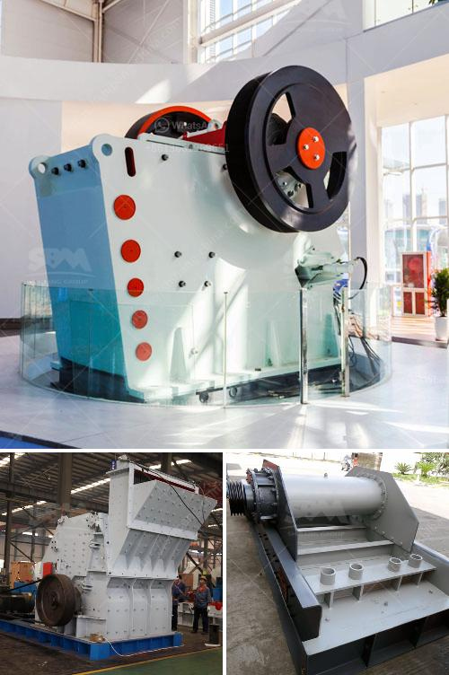

<h3>100 tph stone crusher diesel consumption</h3>
The stone crusher consumes diesel for fuel, which can be divided into two types: diesel generator and diesel engine. Because diesel generator sets are limited in their application scope, the diesel engine stone crusher has been gradually recognized by people.

The commonly used mechanical crushing equipment in the industry is the jaw crusher and the cone crusher. The jaw crusher consumes diesel as the power source, and the output is 100 tph. Its specification is 600×900, and processing capacity 150-200 tons per hour.

The cone crusher consumes diesel as the stone crusher, and the output can reach 100 tph. Its specification is HPC200, and the processing capacity is 130-260 tph.

Each machine has its own processing capacity and the corresponding size of the diesel engine. Generally, the jaw crusher requires a power consumption of 70-80% of the rated power and above 95% of the rated power in case of sudden load fluctuations. The cone crusher requires a power consumption of 50-60% of the rated power and above 90% of the rated power in case of sudden load fluctuations.

The power consumption of the diesel engine varies with the crushing cycled material, the particle size of the feeding material, the moisture content, and other factors.

The diesel consumption of the stone crusher equipment varies with the current working conditions. If the diesel engine does not bear any load, it consumes about 10 liters of diesel per hour and 20 liters when it is working. However, in the actual working process, the diesel consumption may be higher.

In addition to the power consumption of the diesel engine, the maintenance and operation of the stone crusher also play an important role in saving fuel. Regular maintenance, such as timely oil change, cleaning, and tightening of parts, can reduce unnecessary fuel consumption caused by mechanical friction and improve the working efficiency of the machine. Proper operation of the stone crusher can avoid excessive load and reduce the impact on the engine, thus saving fuel consumption.

Therefore, in order to reduce the diesel consumption of the stone crusher, it is necessary to select an appropriate model of stone crusher according to the specific production requirements, control the feeding particle size, moisture content, and other factors, and carry out regular maintenance and operation, so as to improve the efficiency and reduce fuel consumption.

In conclusion, the consumption of diesel in 100 tph stone crusher equipment varies with the current working conditions and the specific requirements of the production process. To ensure the smooth operation of the machine and reduce unnecessary fuel consumption, it is recommended to select an appropriate model, control the feeding particle size and moisture content, and carry out regular maintenance and proper operation.
<h3>Contact us</h3><ul><li><strong>Whatsapp:&nbsp;<a href="https://wa.me/8613661969651">+8613661969651</a></strong></li><li><a href="https://swt.shibang-china.com/?git&amp;zhl&amp;100 tph stone crusher diesel consumption"><strong>Online Service(chat now)</strong></a></li></ul><h3>Related</h3><ul><li><a href='rubber grinder machine in philippines.md'>rubber grinder machine in philippines</a></li><li><a href='ball mill price list.md'>ball mill price list</a></li><li><a href='50tph jaw crusher with magnet.md'>50tph jaw crusher with magnet</a></li><li><a href='dolomite mining and processing.md'>dolomite mining and processing</a></li><li><a href='horizontal stone ball mill.md'>horizontal stone ball mill</a></li></ul>