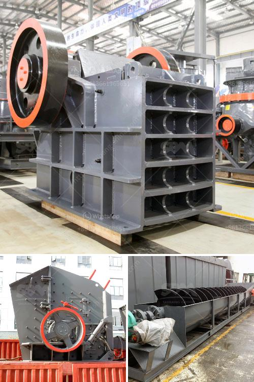

<h3>100tpd cement plant project cost</h3>
Building materials industry is growing rapidly with the increase in demand for cement. The cement industry has been expanding on the back of infrastructure development projects, increasing urbanization, and booming construction activities. To meet this rising demand, many players in the market are looking to set up cement plants.

One such project that has caught the attention of the industry players is the 100TPD cement plant. The 100TPD cement plant implies the kiln wheels manufactured by the company are capable of revamping the existing units, making them entirely modern. The 100TPD cement plant project cost is around $20 million and it will take around 12 months to complete. This is a significant investment considering that this project is being undertaken in a region with limited access to raw materials.

The project will involve setting up a new cement production line with a capacity of 100 tons per day. The plant will be located at a strategic location near the limestone quarry to minimize transportation costs. The raw materials required for cement production, such as limestone, clay, and gypsum, will be sourced from the nearby quarry.

The 100TPD cement plant will be equipped with the latest technology to ensure high efficiency and reduce energy consumption. Modern kiln technology will be used to burn the raw materials at high temperatures to produce clinker. The clinker will then be ground with gypsum and other additives to produce cement.

The project cost includes various components such as land acquisition, construction, machinery, equipment, and installation. It also includes costs for obtaining necessary permits and licenses, as well as administrative and legal fees. Additionally, a significant portion of the project cost will be allocated to the purchase and transportation of raw materials.

One of the major challenges in setting up a cement plant project is the availability of skilled labor. The project will require hiring experienced engineers, technicians, and workers who are well-versed in cement production processes. Training programs may need to be organized to enhance the skills of the local workforce, thereby creating employment opportunities in the region.

Another aspect to consider in the project cost estimation is the environmental impact assessment and compliance with local regulations. Cement production can have adverse environmental effects, such as air pollution and water contamination. Therefore, the project cost also includes investments in pollution control measures and waste management systems.

The 100TPD cement plant project is expected to provide a boost to the local economy by generating employment, stimulating infrastructure development, and promoting the growth of ancillary industries. It will also help meet the growing demand for cement in the region.

In conclusion, setting up a 100TPD cement plant project involves a significant investment of around $20 million. The project cost includes land acquisition, construction, machinery, equipment, and installation, as well as the costs for obtaining permits and licenses. It requires skilled labor and compliance with environmental regulations. Despite the challenges, the project promises economic benefits and meets the growing demand for cement in the region.
<h3>Contact us</h3><ul><li><strong>Whatsapp:&nbsp;<a href="https://wa.me/8613661969651">+8613661969651</a></strong></li><li><a href="https://swt.shibang-china.com/?git&amp;zhl&amp;100tpd cement plant project cost"><strong>Online Service(chat now)</strong></a></li></ul><h3>Related</h3><ul><li><a href='tata stone crusher machines nairobi.md'>tata stone crusher machines nairobi</a></li><li><a href='stone pickers machine in india.md'>stone pickers machine in india</a></li><li><a href='business plan on quarry crusher.md'>business plan on quarry crusher</a></li><li><a href='rock crusher for chromium or chromite ore.md'>rock crusher for chromium or chromite ore</a></li><li><a href='how much is a hammer mill.md'>how much is a hammer mill</a></li></ul>