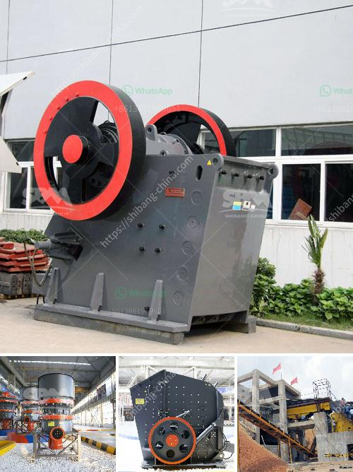

<h3>100tph coal crushing process</h3>
The coal crushing process is a significant stage in the mining industry. With the fast development of China's economy, demand for coal is increasing day by day. Coal is essential as a fuel for the production of electricity and heat generated by burning it in industrial processes. 

A 100tph coal crushing process is a crucial part of a coal preparation plant. The coal is crushed into small pieces to reduce the overall size of the coal for further processing. In this process, the coal passes through a feeder to deliver a uniform flow of coal to the crusher. The crusher then breaks the coal into smaller pieces by using various types of crushing mechanisms.

One common type of crusher used in coal crushing is the jaw crusher, which is generally used for primary crushing of coal. The jaw crusher utilizes a moving plate to exert pressure on the coal, thereby crushing it against another fixed plate. This process is effective in reducing the size of large coal chunks into smaller pieces.

After primary crushing, the crushed coal is further processed using a secondary crusher. In this stage, the coal is reduced to a size suitable for the coal washing process. Various types of crushers, such as impact crushers and cone crushers, are commonly used for secondary crushing. These crushers have different crushing mechanisms that provide better control over the final product size.

Once the coal is crushed to the desired size, it is then screened to separate the coal particles according to their size. The screening process ensures that only the coal of the desired size is sent for further processing, while the oversized and undersized coal particles are rejected. 

In conclusion, the 100tph coal crushing process is a crucial step in the coal preparation plant. It involves the crushing of the coal into smaller pieces using various crushing mechanisms. This process prepares the coal for further beneficiation and ensures that only the coal of the desired size is used for energy production.
<h3>Contact us</h3><ul><li><strong>Whatsapp:&nbsp;<a href="https://wa.me/8613661969651">+8613661969651</a></strong></li><li><a href="https://swt.shibang-china.com/?git&amp;zhl&amp;100tph coal crushing process"><strong>Online Service(chat now)</strong></a></li></ul><h3>Related</h3><ul><li><a href='stone grinding plant.md'>stone grinding plant</a></li><li><a href='used granite machines for sale cone crusher stone crusher.md'>used granite machines for sale cone crusher stone crusher</a></li><li><a href='construction equipment manufacturer in turkey.md'>construction equipment manufacturer in turkey</a></li><li><a href='ball mill for sale in china.md'>ball mill for sale in china</a></li><li><a href='stone crusher powder which products in use in philippines.md'>stone crusher powder which products in use in philippines</a></li></ul>