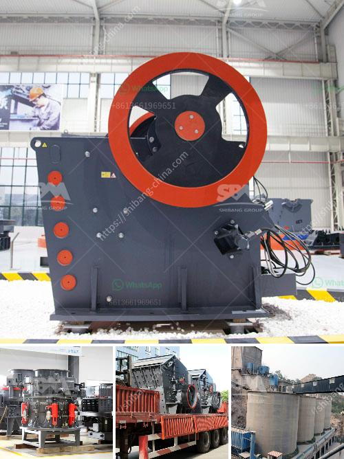

<h3>100tph vibratory feeder</h3>
A vibratory feeder is an advanced conveying equipment that utilizes vibration to transfer bulk materials evenly and consistently from one place to another. It is commonly used in industries such as mining, metallurgy, building materials, chemical, and power plants to feed materials into crushers, screens, and other processing equipment.

The 100tph vibratory feeder is a high-capacity equipment capable of efficiently handling large volumes of materials. It is designed to provide a continuous and controlled flow of materials, ensuring a smooth and efficient production process. With a capacity of 100 tons per hour, this vibratory feeder can handle heavy-duty applications, making it ideal for industries that require high-output operations.

One of the key features of the 100tph vibratory feeder is its ability to regulate the flow rate of materials. This is achieved through the use of vibration, which can be adjusted to match the requirements of the specific application. By controlling the vibration intensity and frequency, the feeder can ensure that the material flow remains stable and uniform. This not only improves efficiency but also helps prevent clogs and blockages, minimizing downtime and ensuring a continuous production process.

The 100tph vibratory feeder is also equipped with a range of safety features to ensure operator and equipment safety. It is often designed with an overload protection system that automatically shuts down the feeder if excessive loads or jams are detected. This prevents damage to the equipment and any potential hazards associated with the overloading of materials.

Furthermore, the 100tph vibratory feeder is built to withstand the harsh and demanding conditions of industrial environments. It is typically constructed from high-quality materials, such as stainless steel or hardened steel, to ensure durability and longevity. It is also designed with easy maintenance and cleaning in mind, with removable parts and access points that facilitate inspection and servicing.

In conclusion, the 100tph vibratory feeder is a reliable and efficient conveying equipment for handling large volumes of bulk materials. Its high capacity, adjustable flow rate, and safety features make it suitable for various industries, from mining and metallurgy to chemical and power plants. With its robust construction and low maintenance requirements, it provides a cost-effective solution for improving material handling processes and optimizing production efficiency. Whether used as a standalone equipment or integrated into a larger processing system, the 100tph vibratory feeder offers numerous benefits to manufacturers and operators alike.
<h3>Contact us</h3><ul><li><strong>Whatsapp:&nbsp;<a href="https://wa.me/8613661969651">+8613661969651</a></strong></li><li><a href="https://swt.shibang-china.com/?git&amp;zhl&amp;100tph vibratory feeder"><strong>Online Service(chat now)</strong></a></li></ul><h3>Related</h3><ul><li><a href='barite mining and quarry equipment spain.md'>barite mining and quarry equipment spain</a></li><li><a href='sand crushing grinding screening production machinerys.md'>sand crushing grinding screening production machinerys</a></li><li><a href='gypsum board machinery turkey manufacturers.md'>gypsum board machinery turkey manufacturers</a></li><li><a href='construction equipment manufacturer in turkey.md'>construction equipment manufacturer in turkey</a></li><li><a href='harga stone crusher plant merk.md'>harga stone crusher plant merk</a></li></ul>