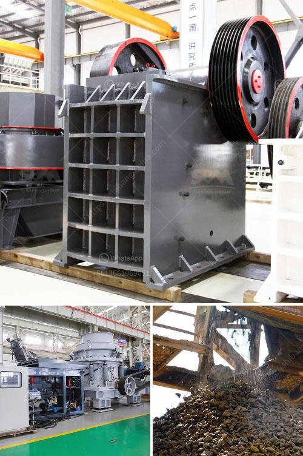

<h3>130 150 jaw crusher</h3>
The 130-150 jaw crusher is commonly used as a primary crusher in the field of mines, quarries, recycling, and construction. It is specially designed to crush various types of materials, including hard and abrasive rocks, stones, and ores. With a feed size of up to 800mm, this jaw crusher delivers high crushing ratios and ensures a consistent product shape.

The 130-150 jaw crusher has a robust construction that enables it to handle heavy-duty operations. Its durable frame and components make it capable of withstanding harsh working conditions and extended use. This crusher is equipped with a powerful 150 HP electric motor that provides excellent performance and efficiency.

One of the key features of this jaw crusher is its hydraulically adjustable CSS (closed-side setting). This feature allows the user to control the size of the output material by adjusting the gap between the jaws. The CSS range varies from 50mm to 150mm, providing flexibility and versatility in various applications.

The 130-150 jaw crusher also incorporates a unique overload protection system. In the event of a non-crushable material entering the crushing chamber, the system releases the hydraulic pressure and allows the material to pass through, preventing damage to the crusher and reducing downtime.

Another advantage of this jaw crusher is its user-friendly design. The machine is easy to operate and maintain, with convenient access to critical components. The removable modular side plate design simplifies the replacement of worn-out parts, reducing maintenance time and costs.

In terms of performance, the 130-150 jaw crusher excels in producing high-quality aggregates with excellent particle shape. Its efficient crushing mechanism minimizes the generation of fines and ensures a consistent product gradation.

The versatility of the 130-150 jaw crusher is further enhanced by its compatibility with various screening solutions. It can be easily integrated with a variety of screens and conveyors, allowing for efficient processing of different materials and applications.

In conclusion, the 130-150 jaw crusher is a reliable and efficient primary crusher that offers high performance and durability. Its robust construction, adjustable CSS, and overload protection system make it suitable for a wide range of applications. Whether it is processing hard rocks, stones, or ores, this jaw crusher delivers consistent results and ensures a high-quality end product.
<h3>Contact us</h3><ul><li><strong>Whatsapp:&nbsp;<a href="https://wa.me/8613661969651">+8613661969651</a></strong></li><li><a href="https://swt.shibang-china.com/?git&amp;zhl&amp;130 150 jaw crusher"><strong>Online Service(chat now)</strong></a></li></ul><h3>Related</h3><ul><li><a href='ball milling machine in south africa.md'>ball milling machine in south africa</a></li><li><a href='cement production equipment in germany.md'>cement production equipment in germany</a></li><li><a href='steel slag recycling plant.md'>steel slag recycling plant</a></li><li><a href='crushing plant price.md'>crushing plant price</a></li><li><a href='gold refining and essay report equipment.md'>gold refining and essay report equipment</a></li></ul>