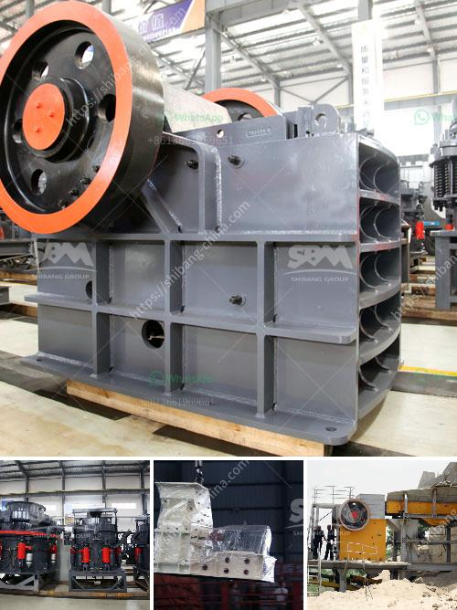

<h3>20 ton peru mobile crushing plant</h3>
The demand for mobile crushing plants is increasing as construction and mining industries utilize this efficient form of machinery to accomplish their projects. A noteworthy addition to this sector is the 20-ton Peru mobile crushing plant, developed by a leader in the mining and construction industry. This state-of-the-art machinery provides a solution that is adaptable to various terrains, making it an ideal option for projects in remote locations.

With a weight of 20 tons, this mobile crushing plant is compact and able to be easily transported to any destination. It is equipped with a range of features that ensure its effectiveness in crushing various materials. The crushing plant is powered by a high-performance diesel engine, capable of delivering reliable and consistent power to efficiently process materials.

The Peru mobile crushing plant is designed to handle a wide variety of materials, including aggregates, weighty rocks, and even ores. By incorporating advanced crushing technologies, this machinery guarantees the production of high-quality aggregates, essential for the construction industry. The plant is able to process a large volume of materials, ensuring quick and efficient completion of projects.

Another outstanding feature of the 20-ton Peru mobile crushing plant is its versatility. It is equipped with a range of optional attachments, such as a hydraulic hammer, grizzly feeder, and vibrating screen. These attachments enhance the plant's capabilities and provide flexibility for project-specific requirements. Whether it is breaking oversized rocks or sorting materials, these attachments make the crushing plant a multipurpose solution.

Furthermore, the Peru mobile crushing plant is designed with operator convenience in mind. It is user-friendly, with an intuitive control panel and easy accessibility to all maintenance points. The plant is also equipped with safety features to ensure the well-being of operators during operation.

In conclusion, the 20-ton Peru mobile crushing plant is a valuable addition to the construction and mining industries. Its compact size, adaptability, and versatility make it a suitable choice for various projects, regardless of the location. Equipped with advanced crushing technologies and optional attachments, this plant guarantees the production of high-quality aggregates while ensuring operator convenience and safety. As these industries continue to grow, the demand for mobile crushing plants like Peru will undoubtedly increase, solidifying its role as a reliable and efficient solution.
<h3>Contact us</h3><ul><li><strong>Whatsapp:&nbsp;<a href="https://wa.me/8613661969651">+8613661969651</a></strong></li><li><a href="https://swt.shibang-china.com/?git&amp;zhl&amp;20 ton peru mobile crushing plant"><strong>Online Service(chat now)</strong></a></li></ul><h3>Related</h3><ul><li><a href='stone crusher price in india.md'>stone crusher price in india</a></li><li><a href='suppliers of conveyor belts in malaysia.md'>suppliers of conveyor belts in malaysia</a></li><li><a href='gypsum mines in pakistan.md'>gypsum mines in pakistan</a></li><li><a href='jaw crusher for sale in harare.md'>jaw crusher for sale in harare</a></li><li><a href='aggregate washing plant for sale.md'>aggregate washing plant for sale</a></li></ul>