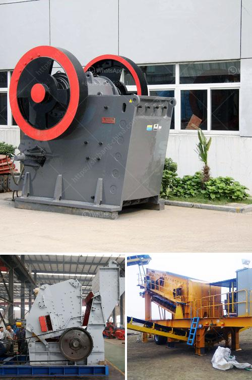

<h3>200 tph coal crushing process</h3>
The coal crushing process is a complex operation that involves a variety of crushing equipment and requires a good understanding of the specifications and regulations related to coal to ensure smooth operation during the crushing process. The coal crushing process is suitable to crush coal materials with maximum particle sizes of 100-600mm to a size close to 5-25mm.

Before the coal is subjected to the crushing process, it needs to be stored and prepared in a way that meets the specifications of the end user. This includes screening the coal for undesirable particles, such as rocks and wood, and removing any metal contaminants.

The primary crusher is a machine designed to reduce the size of large rocks or ores to a manageable size. It is typically used in the first stage of the crushing process and operates by applying compressive forces to the material. In the case of coal, the primary crusher operates by impacting the coal against a rotating plate.

Following the primary crushing stage, the coal is further reduced in size by the secondary crusher. This crusher is usually a cone or impact crusher, which operates by reducing the material between a mantle and a concave.

After the coal has been crushed, it is necessary to screen it to separate it into different size fractions. This is achieved by passing the crushed coal through a series of screens with different sizes of openings. The screened coal is then further processed according to the end user's requirements.

If the coal needs to be cleaned, it is subjected to a washing process, which removes impurities and reduces the ash content. This is usually done by immersing the coal in a water-based solution and then using a combination of gravity separation and flotation techniques to separate the impurities from the coal. The dewatering process involves removing the excess moisture from the washed coal to improve its handling and storage properties.

Once the coal has been washed and dewatered, it is often further crushed in a sizing plant, which produces the final product size required by the customer. The sizing plant typically consists of a series of crushers and screens arranged in a circuit, with the crushed coal being conveyed from one stage to another until the desired size is achieved.

Overall, the coal crushing process is a complex operation that requires a good understanding of the specifications and regulations related to coal. By following the correct procedures and using the appropriate crushing equipment, operators can ensure a smooth and efficient crushing process, resulting in a high-quality product that meets the end user's requirements.
<h3>Contact us</h3><ul><li><strong>Whatsapp:&nbsp;<a href="https://wa.me/8613661969651">+8613661969651</a></strong></li><li><a href="https://swt.shibang-china.com/?git&amp;zhl&amp;200 tph coal crushing process"><strong>Online Service(chat now)</strong></a></li></ul><h3>Related</h3><ul><li><a href='quarry dust in concrete sand making stone quarry.md'>quarry dust in concrete sand making stone quarry</a></li><li><a href='crusher mobile stone.md'>crusher mobile stone</a></li><li><a href='product of 100 tons mini cement plant.md'>product of 100 tons mini cement plant</a></li><li><a href='salvage value of crusher machine.md'>salvage value of crusher machine</a></li><li><a href='ball mills china.md'>ball mills china</a></li></ul>