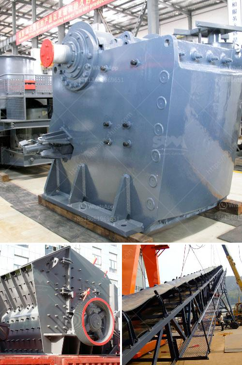

<h3>250 mesh hammer mill</h3>
The 250 mesh hammer mill is an essential piece of equipment in the pharmaceutical and food processing industries. You can use it to crush, pulverize, shred, grind, and reduce different types of materials to the desired size. With its high-speed rotating blades, the mill efficiently breaks down materials into fine particles.

The primary advantage of the 250 mesh hammer mill is its versatility. It can process a wide range of materials, including herbs, spices, grains, minerals, and fibrous substances. The mill's design allows for easy interchangeability of screens, enabling users to achieve different particle sizes. This flexibility makes it an excellent choice for various applications, from producing spices and seasonings to manufacturing pharmaceutical powders.

Furthermore, the 250 mesh hammer mill ensures consistent and uniform particle size distribution, which is crucial for achieving optimal product quality. Its powerful capabilities make it ideal for reducing the particle size of heat-sensitive materials without compromising their integrity. The hammer mill's high rotation speed and robust construction guarantee durability and long-term usage.

Another significant advantage of the 250 mesh hammer mill is its compact size, making it suitable for both small-scale and large-scale operations. It requires minimal floor space and can easily fit into existing production lines. Moreover, its straightforward operation and low maintenance requirements contribute to its overall efficiency and cost-effectiveness.

To ensure safety and prevent contamination, the 250 mesh hammer mill is typically manufactured using high-quality stainless steel or other food-grade materials. This construction material ensures that no impurities or foreign substances are introduced during the milling process, making it suitable for applications that require strict sanitation standards.

In conclusion, the 250 mesh hammer mill is a versatile and efficient machine that plays a vital role in many industries. Its ability to reduce various materials to the desired size, its uniform particle size distribution, and its compact design make it an excellent choice for pharmaceutical and food processing applications. With its reliability and durability, this hammer mill is a valuable asset for any production facility.
<h3>Contact us</h3><ul><li><strong>Whatsapp:&nbsp;<a href="https://wa.me/8613661969651">+8613661969651</a></strong></li><li><a href="https://swt.shibang-china.com/?git&amp;zhl&amp;250 mesh hammer mill"><strong>Online Service(chat now)</strong></a></li></ul><h3>Related</h3><ul><li><a href='chrome ore beneficiation plant in china.md'>chrome ore beneficiation plant in china</a></li><li><a href='cement machinery suppliers grinding unit.md'>cement machinery suppliers grinding unit</a></li><li><a href='iron ore mines cost structure.md'>iron ore mines cost structure</a></li><li><a href='100tpd cement plant project cost.md'>100tpd cement plant project cost</a></li><li><a href='sand screeding machine prices.md'>sand screeding machine prices</a></li></ul>