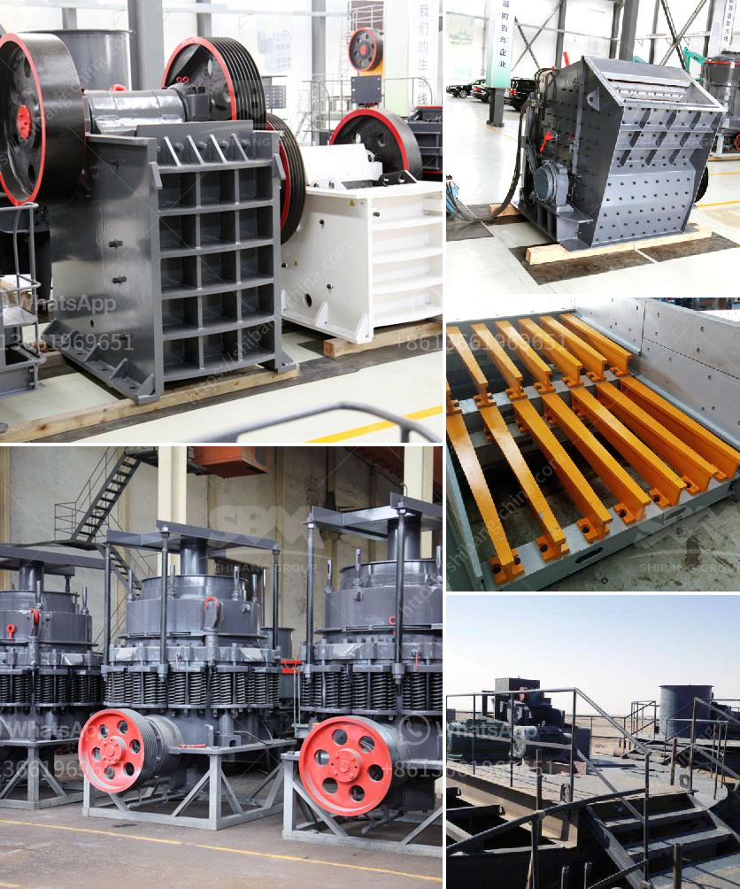

<h3>250tph grinding equipment price</h3>
If you are in the market for a grinding equipment with a capacity of 250tph, it is important to consider various factors before making a purchase. One crucial aspect to evaluate is the price of the equipment. In this article, we will discuss the average price range for 250tph grinding equipment and factors that can influence the cost.

The price of grinding equipment can vary widely depending on several factors such as brand, specifications, and additional features. On average, a 250tph grinding equipment can cost anywhere from $50,000 to $500,000. It is advisable to research and compare prices from different manufacturers to ensure you are getting the best value for your money.

Several features can impact the price of grinding equipment. One such feature is the type of grinding mill used. There are different types of grinding mills available, such as ball mills, vertical roller mills, and Raymond mills. Each of these types has its own advantages and disadvantages, which can affect the overall price of the equipment.

Another factor that can influence the cost is the material used for construction. Grinding equipment designed for heavy-duty mineral processing applications is typically made of high-quality materials to ensure durability and longevity. This can increase the price compared to equipment made of lower-grade materials.

The power consumption and efficiency of the equipment can also impact the price. Grinding equipment that consumes less energy and achieves higher grinding efficiency may cost more upfront but can lead to significant savings in operational costs over time. It is crucial to consider the long-term implications of energy consumption when evaluating the equipment's price.

Additional features and customization options can also drive up the price of grinding equipment. Some manufacturers offer advanced control systems, automated processes, and remote monitoring capabilities. While these features can enhance productivity and efficiency, they come at an additional cost. It is essential to assess your specific requirements and determine if these features are necessary for your operation.

Apart from the equipment price, it is important to consider other factors that can impact the overall cost of owning grinding equipment. These include installation and commissioning expenses, maintenance and spare parts costs, and operational costs such as energy consumption and labor.

To make an informed decision, it is advisable to consult with reputable manufacturers, read customer reviews, and request quotes from multiple suppliers. By considering multiple factors such as price, specifications, features, and long-term costs, you can select the most suitable grinding equipment for your application.

In conclusion, the price for 250tph grinding equipment can range from $50,000 to $500,000 depending on factors such as brand, specifications, and additional features. Considering various aspects such as type of grinding mill, construction materials, power consumption, and customization options can help you determine the best value for your investment. Remember to also consider installation, maintenance, and operational costs before finalizing your purchase.
<h3>Contact us</h3><ul><li><strong>Whatsapp:&nbsp;<a href="https://wa.me/8613661969651">+8613661969651</a></strong></li><li><a href="https://swt.shibang-china.com/?git&amp;zhl&amp;250tph grinding equipment price"><strong>Online Service(chat now)</strong></a></li></ul><h3>Related</h3><ul><li><a href='vertical roller mills manufacturer in india.md'>vertical roller mills manufacturer in india</a></li><li><a href='buy crusher of pact in peru.md'>buy crusher of pact in peru</a></li><li><a href='turnkey project for gypsum board manufacturing plant.md'>turnkey project for gypsum board manufacturing plant</a></li><li><a href='dolomite mining and processing.md'>dolomite mining and processing</a></li><li><a href='cement factory plant cost.md'>cement factory plant cost</a></li></ul>