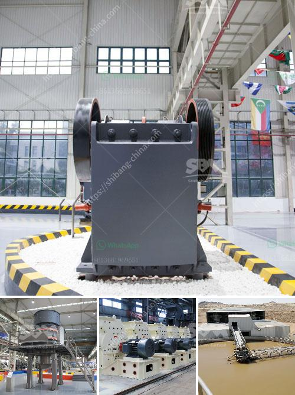

<h3>2nd hand bentonite grinding mill</h3>
Title: Exploring the Benefits of Second-Hand Bentonite Grinding Mills: Affordable and Efficient Solutions

The mining and construction industry often requires a reliable and cost-effective solution for grinding materials, particularly in the processing of minerals, ores, and other industrial raw materials. Bentonite, a unique clay mineral with exceptional properties, is widely used in various sectors, including ceramics, foundry, and drilling mud. The demand for bentonite grinding mills has grown significantly, prompting both manufacturers and consumers to consider second-hand options as viable alternatives. In this article, we explore the benefits of investing in second-hand bentonite grinding mills.

One of the primary advantages of purchasing a second-hand bentonite grinding mill is the cost-effectiveness associated with it. Second-hand mills are often available at a fraction of the cost compared to new ones, enabling budget-conscious businesses to acquire high-quality machinery without breaking the bank. Since grinding mills have robust structures and undergo regular maintenance, the durability of second-hand machines is generally intact, providing long-lasting and reliable operation.

Another key advantage of opting for a second-hand bentonite grinding mill is its quick set-up process. Unlike new mills that require extensive assembly and calibration, used mills are typically ready for operation, allowing businesses to speed up their production processes. With a shorter installation period, companies can quickly enhance their overall productivity and meet industry demands more efficiently.

Proper maintenance and regular servicing ensure that second-hand grinding mills are in optimal condition. Trusted sellers and suppliers adhere to strict quality control protocols to ensure that the equipment is thoroughly inspected before being sold. Buyers can request any necessary documentation related to previous maintenance and repairs. Additionally, purchasing from reputable sellers often includes a warranty period, giving customers peace of mind regarding the authenticity and working condition of the machine.

Choosing a second-hand bentonite grinding mill is not only an economical but also an environmentally conscious decision. By extending the product's lifespan through reuse, the demand for new machinery decreases, resulting in reduced energy consumption, carbon emissions, and raw material extraction. Thus, businesses can contribute positively to sustainable development initiatives while benefiting from the cost savings associated with second-hand purchases.

Reputed sellers of second-hand grinding mills often offer technical support and assistance with installation, operation, and maintenance. Their expertise in handling similar equipment ensures buyers receive comprehensive guidance and troubleshooting advice. This support system proves invaluable, particularly for businesses that may not have dedicated technical personnel on their staff.

The merits of investing in second-hand bentonite grinding mills cannot be overlooked. Their affordability, quick set-up process, quality assurance, reduced environmental impact, and access to expert support make them an appealing option for companies seeking efficient and economical grinding solutions. However, it is crucial to identify trusted sellers with a proven track record to ensure the reliability and longevity of the second-hand machinery. By doing so, businesses can streamline their operations, enhance productivity, and contribute to a more sustainable future.
<h3>Contact us</h3><ul><li><strong>Whatsapp:&nbsp;<a href="https://wa.me/8613661969651">+8613661969651</a></strong></li><li><a href="https://swt.shibang-china.com/?git&amp;zhl&amp;2nd hand bentonite grinding mill"><strong>Online Service(chat now)</strong></a></li></ul><h3>Related</h3><ul><li><a href='manufacturers and supplyers of quarry equipment.md'>manufacturers and supplyers of quarry equipment</a></li><li><a href='second hand quarry equipment price philippines.md'>second hand quarry equipment price philippines</a></li><li><a href='dolomite powder uses in agriculture.md'>dolomite powder uses in agriculture</a></li><li><a href='artificial stone manufacturing process.md'>artificial stone manufacturing process</a></li><li><a href='tonne ball mill.md'>tonne ball mill</a></li></ul>