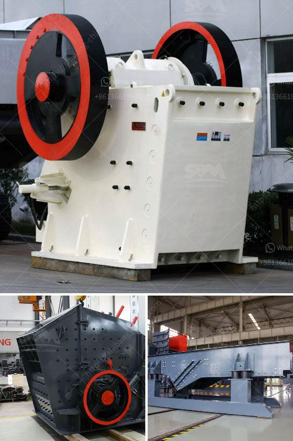

<h3>2nd hand old mining process plant</h3>
The mining industry is a vital sector that provides the resources necessary for various industries and economies to thrive. However, the process of extracting minerals is often energy-intensive and can leave behind a significant environmental footprint. As the world strives towards sustainable practices, the concept of second-hand mining process plants has gained prominence.

Second-hand mining process plants refer to the reuse and repurposing of old mining equipment and machinery to undertake mining operations effectively. These plants are typically acquired from decommissioned sites or from companies looking to upgrade their existing machinery. By utilizing second-hand plants, mining companies can significantly reduce their capital expenditure while simultaneously minimizing their environmental impact.

One of the significant advantages of second-hand mining process plants is cost-effectiveness. Acquiring new machinery and equipment can be a substantial investment for mining companies. However, by opting for second-hand plants, companies can save a considerable amount of money. These cost savings can then be reinvested in other areas of the mining operation, such as employee training, technological advancements, or environmental sustainability initiatives.

Moreover, second-hand mining process plants can be refurbished to meet the specific requirements of a mining project. The customization possibilities allow companies to optimize the machinery to fit their unique operational needs. This level of adaptability ensures that the equipment can be utilized efficiently, maximizing productivity while minimizing wastage of resources.

Another significant benefit of second-hand mining process plants is their contribution to sustainability and environmental conservation. By reusing existing machinery, companies reduce the demand for new equipment. This effectively decreases the need for additional mining and extraction of raw materials, leading to a reduced environmental impact. Additionally, the refurbishment and optimization process can enhance energy efficiency, further reducing the ecological footprint of the mining operation.

However, there are some challenges associated with second-hand mining process plants. Companies must carefully assess the condition and functionality of the machinery before acquisition. Thorough inspections and testing need to be conducted to ensure that the equipment is capable of meeting the desired production requirements. Additionally, regular maintenance and repairs are essential to keep the machinery in optimal working condition.

It is also crucial to note that the availability of second-hand mining process plants may vary based on location and industry demand. Mining companies must be proactive in researching and identifying suitable plants to benefit from the cost savings and sustainability advantages of second-hand equipment.

In conclusion, second-hand mining process plants offer a viable and sustainable solution for companies looking to minimize their environmental impact while maximizing cost savings. These plants provide an opportunity for mining companies to repurpose existing machinery and optimize it to meet specific operational needs. By embracing the concept of second-hand equipment, the mining industry can align itself with the principles of sustainability and contribute to a greener future.
<h3>Contact us</h3><ul><li><strong>Whatsapp:&nbsp;<a href="https://wa.me/8613661969651">+8613661969651</a></strong></li><li><a href="https://swt.shibang-china.com/?git&amp;zhl&amp;2nd hand old mining process plant"><strong>Online Service(chat now)</strong></a></li></ul><h3>Related</h3><ul><li><a href='hammer mill grinder for sale in dubai.md'>hammer mill grinder for sale in dubai</a></li><li><a href='price of small scale cement plant in india.md'>price of small scale cement plant in india</a></li><li><a href='roller mill calcium.md'>roller mill calcium</a></li><li><a href='large capacity ton per hour limestone crushers.md'>large capacity ton per hour limestone crushers</a></li><li><a href='copper crusher pressure gauge manufacturer.md'>copper crusher pressure gauge manufacturer</a></li></ul>