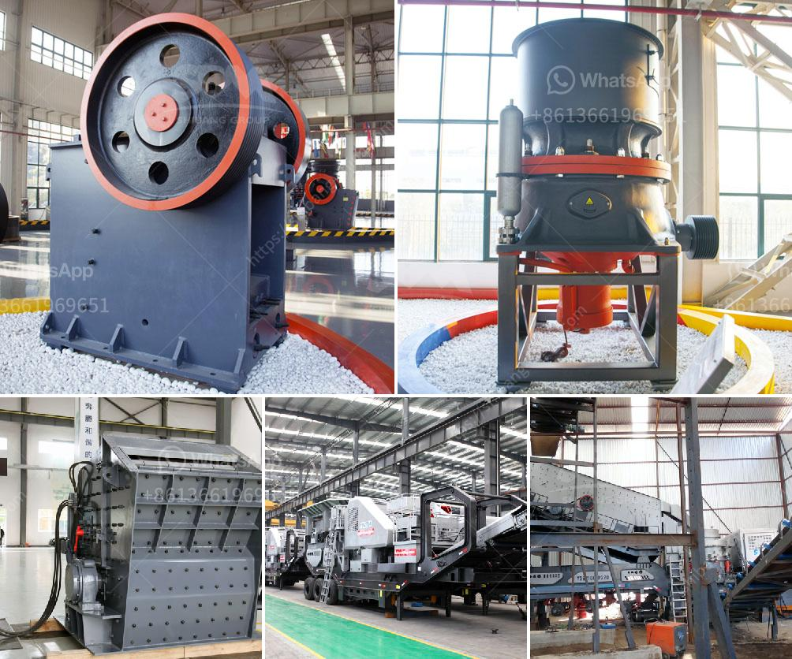

<h3>3 roller raymond mill details process</h3>
The 3 roller Raymond mill is a commonly used milling machine in the mining industry. In order to improve the production efficiency, it is necessary to know three main factors affecting the output of this mill. These factors include the properties of the material, the grading of the grinding roller and the process parameters.

The first factor, the properties of the material, includes the hardness, moisture content, and particle size of the material. Harder materials are more difficult to grind, which may cause the grinding roller to wear quickly. The moisture content also affects the drying capacity. If the material contains too much moisture, it will increase the energy consumption and reduce the output. The particle size of the material is also important because larger particles require more energy to be ground, thus reducing the output.

The second factor, the grading of the grinding roller, refers to the size and shape of the grinding roller. The size of the grinding roller determines the distance between the grinding rings, which in turn affects the fineness of the final product. A smaller roller size will result in a finer final product, while a larger roller size will result in a coarser product. The shape of the roller also affects the grinding efficiency. A roller with a concave shape will have a larger grinding area, resulting in a higher production capacity.

The third factor, the process parameters, includes the speed of the main engine, the classifier speed, and the wind volume. The speed of the main engine determines the grinding force and the rotation speed of the grinding roller. A higher speed will increase the grinding force and improve the production capacity. The classifier speed controls the particle size of the final product. A higher classifier speed will produce a finer product. The wind volume controls the transportation speed of the materials inside the mill. A higher wind volume will increase the material circulation and improve the grinding efficiency.

In conclusion, the performance of the 3 roller Raymond mill is affected by various factors. The properties of the material, the grading of the grinding roller, and the process parameters all play important roles in determining the output of the mill. Understanding these factors and making appropriate adjustments can help improve the production efficiency of the mill. However, it is worth noting that the optimal process parameters may vary depending on the specific material and production requirements. Therefore, it is necessary to conduct experiments and tests to determine the best settings for each individual case.
<h3>Contact us</h3><ul><li><strong>Whatsapp:&nbsp;<a href="https://wa.me/8613661969651">+8613661969651</a></strong></li><li><a href="https://swt.shibang-china.com/?git&amp;zhl&amp;3 roller raymond mill details process"><strong>Online Service(chat now)</strong></a></li></ul><h3>Related</h3><ul><li><a href='jaw crusher start up procedure.md'>jaw crusher start up procedure</a></li><li><a href='crusher allis cone chalmers mod 500.md'>crusher allis cone chalmers mod 500</a></li><li><a href='used mobile screens and crusher in africa.md'>used mobile screens and crusher in africa</a></li><li><a href='price of smallest ballast crusher in kenya.md'>price of smallest ballast crusher in kenya</a></li><li><a href='jaw crusher in kenya.md'>jaw crusher in kenya</a></li></ul>