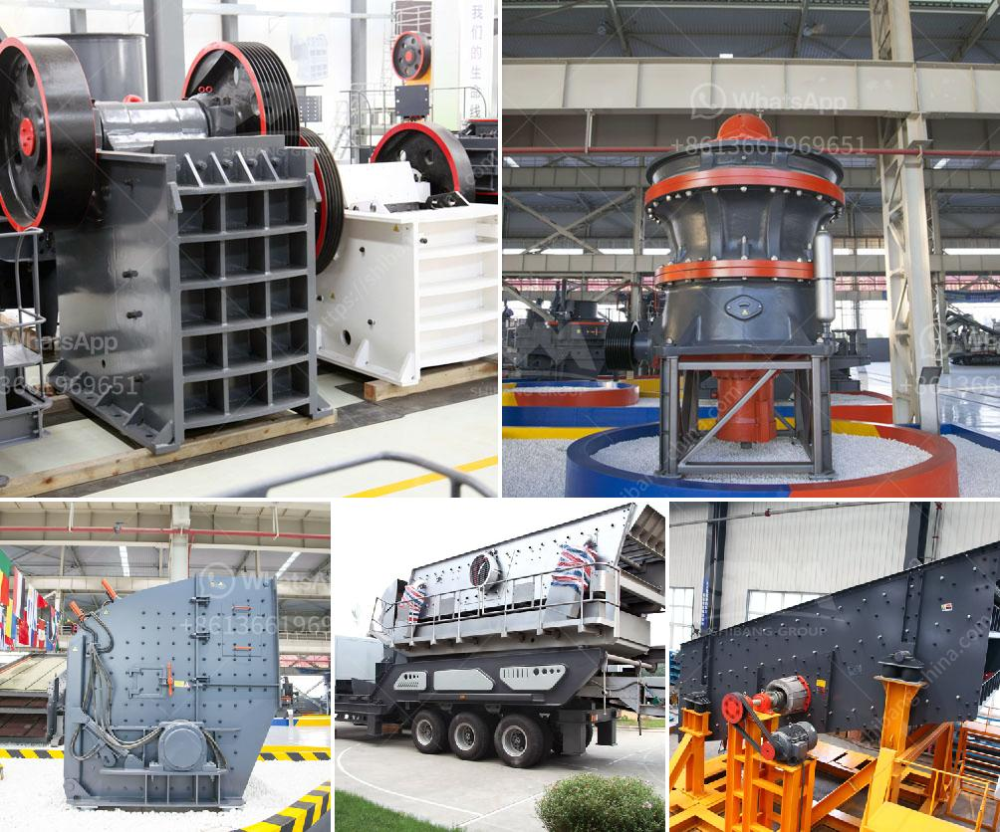

<h3>30t hr 50t hr range stone crusher plant china</h3>
The stone crusher plant is used for producing sand, rock and stone for construction, highway, railway and other applications. Fote Heavy Machinery, with 40 years of experience in the stone crushing production line, is skilled in the production line process design and has a high-cost performance.

Fote stone crusher plant and stone crushing equipment have been sold to hundreds of countries, such as India, Pakistan, Indonesia, Nigeria, Kenya, the USA, Ghana, Zimbabwe, Nepal, Philippines, the UK, Vietnam, Iceland, Canada, etc.

The stone crusher plant to crush stones has been sought after and the sales market of the equipment is very good in recent years due to its wide application, new design, high production efficiency, strong capacity and stable operation. The investment prospect of the stone crusher plant is driven by certain external factors. Let's analyze the investment market of the stone crushing plant.

The particle size distribution characteristics of the feed determine the distribution of the material crushing capacity of the crusher. Similarly, the feed size requirement of different crushers is different.

1. High degree of automation, large crushing ratio, high efficiency, large processing capacity, cubic shape of finished product with minimum needle and slice shaped product and high compression strength without inner crack.

3. Energy saving and environment protection. The range of final products can be adjusted according to different needs. It can be used for primary crushing, secondary crushing and fine crushing.

Regarding the secondary crushing, you can use the impact crusher. The impact crusher has the advantages of high crushing ratio, high crushing efficiency, convenient maintenance, and low production cost. The final product is in the shape of a cube and the particles are in good shape. Invest in a good quality impact crusher and you will get high economic returns.

Fote stone crusher plant prices are different according to different types and production capacity. The feeder or screens separate large blocks from finer rocks that do not require primary crushing, thus reducing the load to the primary crusher. Jaw, impactor, or gyratory crushers are usually used for initial size reduction. The stone that is too large to pass through the top deck of the scalping screen is processed in the secondary crushing plant. Cone crushers are commonly used for secondary crushing.

The output from the secondary crusher and the throughs from the secondary screen are transported by conveyor to the tertiary circuit, which includes a sizing screen and a tertiary crusher. Fote crushers have a very important role in silver ores mining, especially in silver ores crushing process. The jaw crusher is commonly used as the primary crusher and impact crusher, cone crusher are used as secondary crusher.

The ball mill, raymond mill or high pressure mill is often used as grinding machine to grind silver ores to final size. The crushed silver ores will be smelted to get the final product – silver.

Fote mineral stone crusher plant adopts the high quality and excellent configuration. We provide the panty-time maintenance service for various series stone crusher plants, which greatly extends the service life of equipment. With scientific and reasonable prices and reliable quality, we build a series of practical and efficient stone crusher plants.
<h3>Contact us</h3><ul><li><strong>Whatsapp:&nbsp;<a href="https://wa.me/8613661969651">+8613661969651</a></strong></li><li><a href="https://swt.shibang-china.com/?git&amp;zhl&amp;30t hr 50t hr range stone crusher plant china"><strong>Online Service(chat now)</strong></a></li></ul><h3>Related</h3><ul><li><a href='crusher business for sale in oman.md'>crusher business for sale in oman</a></li><li><a href='small scale verticle grinding limestone machine.md'>small scale verticle grinding limestone machine</a></li><li><a href='how to start mining business in india.md'>how to start mining business in india</a></li><li><a href='cement clinker processing plant.md'>cement clinker processing plant</a></li><li><a href='piedra maquinaria agregada equipos de bolivia.md'>piedra maquinaria agregada equipos de bolivia</a></li></ul>