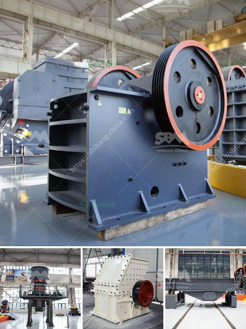

<h3>4 rolar raymond mill productions</h3>
Raymond mill, also known as pendulum mill, has been developed to meet the requirements of customers in terms of grinding capacity and efficiency. With four rollers instead of three, 4 roller Raymond mill is more efficient and productive. This article will discuss four different production models of 4 roller Raymond mill with a capacity ranging from 100 to 300 tons per hour.

1. 4R3216 Raymond Mill: This model has a capacity of 1-3 tons per hour and is the smallest model in the 4 roller Raymond mill series. It is more suitable for small scale powder grinding, making it popular in chemical, mining, metallurgy, and other industries.

2. 4R3220 Raymond Mill: With a capacity of 1-5 tons per hour, this mid-sized model is designed for medium scale production. Its advanced technology ensures a consistent and fine grind, making it suitable for applications in construction, cement, and calcite powder industries.

3. 4R3225 Raymond Mill: This model has a capacity of 1-10 tons per hour and is suitable for large scale production. With its high efficiency and low energy consumption, it has become the preferred choice for grinding brittle materials, such as quartz, limestone, and coal.

4. 4R3226 Raymond Mill: The largest model in the 4 roller Raymond mill series, it has a capacity of 2-10 tons per hour. This heavy-duty mill is ideal for processing non-metallic minerals with a Mohs hardness of 7 or less. Its wide range of applications includes barite, dolomite, talc, and gypsum grinding.

All four models of 4 roller Raymond mill are equipped with high-quality grinding rollers and rings, ensuring long service life and reliable performance. The unique design of the mill reduces vibrations and increases stability, contributing to higher productivity and efficiency.

In conclusion, the 4 roller Raymond mill offers a range of production capacities suitable for different industries and grinding needs. Its advanced technology, efficiency, and reliability make it an excellent choice for those looking to improve their grinding processes. Whether for small scale or large scale production, the 4 roller Raymond mill is a promising solution.
<h3>Contact us</h3><ul><li><strong>Whatsapp:&nbsp;<a href="https://wa.me/8613661969651">+8613661969651</a></strong></li><li><a href="https://swt.shibang-china.com/?git&amp;zhl&amp;4 rolar raymond mill productions"><strong>Online Service(chat now)</strong></a></li></ul><h3>Related</h3><ul><li><a href='cost for a bauxite mining company.md'>cost for a bauxite mining company</a></li><li><a href='portable hard rock mining.md'>portable hard rock mining</a></li><li><a href='cement mill plant design drawings.md'>cement mill plant design drawings</a></li><li><a href='portable stone crusher.md'>portable stone crusher</a></li><li><a href='pe jaw crusher stone jaw crusher for rock crushing.md'>pe jaw crusher stone jaw crusher for rock crushing</a></li></ul>