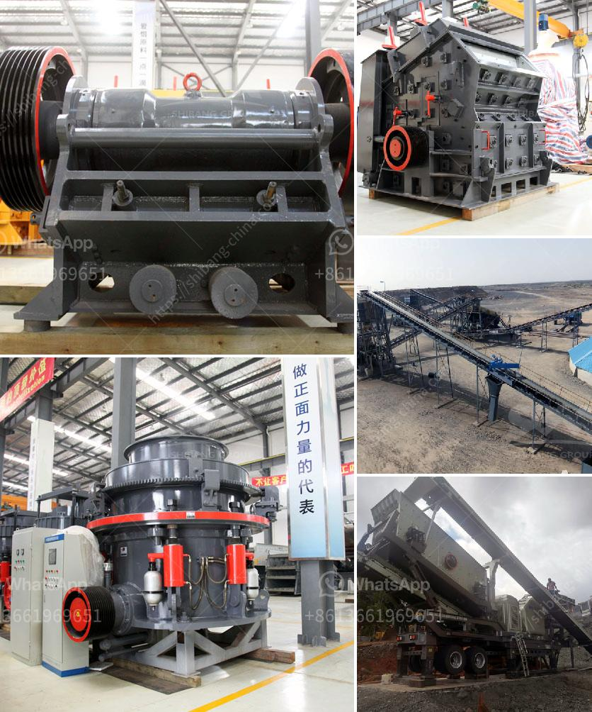

<h3>50 tph raymond mills</h3>
Raymond mills have been around for a long time, and for a good reason. They are known for their versatility and reliability in the grinding industry. With a capacity of 50 tons per hour (TPH), these mills are suitable for a wide range of applications.

The Raymond mill is a vertical roller mill, which is widely used in many industries such as mining, construction, cement, metallurgy, chemicals, and others. It can process various non-flammable and non-explosive materials with a Mohs hardness of less than 9.3 and humidity below 6%.

One of the significant advantages of the 50 TPH Raymond mill is its high efficiency. The mill is designed to grind and classify various materials, ensuring an accurate and consistent product size. Its advanced airflow control system allows for precise control of the air volume and air pressure, ensuring a stable and efficient grinding process.

The 50 TPH Raymond mill also boasts a large feed size capability. With a feed size of up to 35mm, the mill can handle a wide range of materials, reducing the need for secondary crushers or pre-grinding before milling. This saves both time and energy and increases overall productivity.

In addition to its large feed size capacity, the Raymond mill also offers adjustable fineness. The mill's particle size can be adjusted from 80 mesh to 325 mesh, or even finer, depending on the specific requirements of the application. This flexibility allows for precise control over the final product's quality and consistency.

Another standout feature of the 50 TPH Raymond mill is its low energy consumption. The mill is equipped with a high-efficiency separator that effectively separates the fine particles from the coarse ones, minimizing energy wastage. This not only reduces the operational costs but also contributes to a more sustainable and environmentally friendly operation.

Furthermore, the 50 TPH Raymond mill is easy to operate and maintain. Its compact design and user-friendly interface make it suitable for both experienced operators and those new to the industry. The mill is equipped with an advanced control system that allows for easy monitoring and adjustment of various parameters, maximizing its performance and ensuring trouble-free operation.

In conclusion, the 50 TPH Raymond mill is a versatile and reliable solution for your grinding needs. With its high efficiency, large feed size capacity, adjustable fineness, low energy consumption, and ease of operation, this mill is suitable for various applications. Whether you need to grind minerals, chemicals, or other materials, the 50 TPH Raymond mill will deliver consistent and high-quality results. Consider investing in this mill to enhance your grinding processes and boost productivity.
<h3>Contact us</h3><ul><li><strong>Whatsapp:&nbsp;<a href="https://wa.me/8613661969651">+8613661969651</a></strong></li><li><a href="https://swt.shibang-china.com/?git&amp;zhl&amp;50 tph raymond mills"><strong>Online Service(chat now)</strong></a></li></ul><h3>Related</h3><ul><li><a href='coal crusher machine in zhengzhou henan china.md'>coal crusher machine in zhengzhou henan china</a></li><li><a href='earth moving equipment duty free in zimbabwe.md'>earth moving equipment duty free in zimbabwe</a></li><li><a href='used granite machines for sale cone crusher stone crusher.md'>used granite machines for sale cone crusher stone crusher</a></li><li><a href='german crushing stone plant.md'>german crushing stone plant</a></li><li><a href='crushing production line in equipment.md'>crushing production line in equipment</a></li></ul>