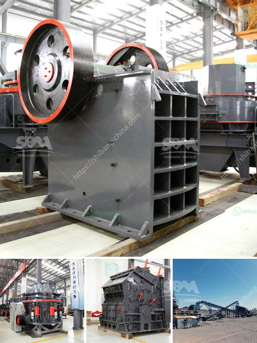

<h3>500 ton per hr crusher price</h3>
Title: Evaluating the Crushing Potential of the 500-ton per hour Crusher: A Cost-efficient Solution for Large-scale Operations

In today's industrial landscape, efficient crushing machines fuel productivity for large-scale operations. The 500-ton per hour crusher offers reliable crushing capabilities that are crucial in the competitive aggregate production market. This article will explore the key features and advantages of the 500-ton per hour crusher, highlighting its overall value and cost-effectiveness.

The 500-ton per hour crusher boasts exceptional crushing capacity, making it suitable for heavy-duty operations in mining, quarrying, and recycling applications. With a high feed opening and a steep crushing chamber, this machine can accept even the largest feed sizes, delivering consistently high-quality output. Its robust construction and durable components ensure the crusher's longevity and reliability, even under the most demanding conditions.

One of the remarkable features of the 500-ton per hour crusher is its efficient power utilization. Equipped with advanced technology, this machine optimizes energy consumption, lowering operational costs. Its hydraulic system enhances productivity by providing adjustable and reliable settings for the crushing process. Additionally, the crusher's easy-to-maintain design minimizes downtime for maintenance, further increasing productivity and overall efficiency.

Considering its impressive performance and remarkable productivity, the 500-ton per hour crusher offers a cost-effective solution for large-scale operations. Its ability to handle substantial volumes of material translates into fewer machines needed to meet production targets, reducing capital and operational expenses. Moreover, the machine's longevity and low maintenance requirements contribute to additional cost savings over its lifespan.

The price of the 500-ton per hour crusher varies depending on several factors such as optional features, customization, and geographic location. It is advisable to consult with a reputable manufacturer or distributor to obtain an accurate price quote tailored to specific requirements. Considering the crusher's durability, high output capacity, and cost-effectiveness, it is a worthwhile investment for long-term profitability.

The 500-ton per hour crusher delivers exceptional crushing capabilities, providing a cost-effective solution for large-scale operations in various industries. Its productivity, efficiency, and overall value make it an attractive choice for businesses looking to optimize their crushing process.
<h3>Contact us</h3><ul><li><strong>Whatsapp:&nbsp;<a href="https://wa.me/8613661969651">+8613661969651</a></strong></li><li><a href="https://swt.shibang-china.com/?git&amp;zhl&amp;500 ton per hr crusher price"><strong>Online Service(chat now)</strong></a></li></ul><h3>Related</h3><ul><li><a href='ball mill small for sale.md'>ball mill small for sale</a></li><li><a href='stone crusher machine from japan.md'>stone crusher machine from japan</a></li><li><a href='how to set up a crushing plant.md'>how to set up a crushing plant</a></li><li><a href='chrome washing machine plant eluvial mill gold.md'>chrome washing machine plant eluvial mill gold</a></li><li><a href='crusher machinery.md'>crusher machinery</a></li></ul>