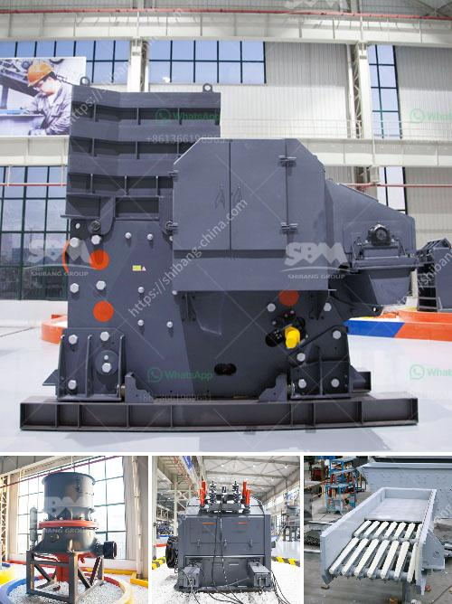

<h3>50tph jaw crusher with magnet</h3>
The jaw crusher with magnet is a powerful and efficient machine that is used for crushing rocks and ores. It is ideal for primary crushing of materials such as limestone, granite, and recycled concrete. With its impressive capacity of 50 tph, this machine is capable of producing excellent quality aggregates for road construction, railway ballast, and concrete production.

The magnet is an essential feature of this jaw crusher as it helps in separating and removing unwanted metal particles from the crushed material. This ensures that the final product is free from any metallic impurities and meets the required specifications.

One of the key advantages of the jaw crusher with magnet is its compact design and easy installation. Due to its smaller size, it can be easily transported to different locations, making it suitable for both stationary and mobile crushing operations. This versatility allows contractors to maximize their productivity by taking the crusher directly to the construction site, eliminating the need for additional transportation.

The jaw crusher with magnet is equipped with a reliable and efficient diesel engine that provides power to the crusher. This engine is designed to minimize fuel consumption while delivering high performance. With its low operating costs, this machine is an economical choice for contractors and quarry operators.

In terms of operation, the jaw crusher with magnet is user-friendly and requires minimal maintenance. The machine is equipped with a hydraulic system that provides quick and easy access to the crushing chamber, making it convenient for regular cleaning and inspection. Additionally, the jaw crusher is designed with a safety toggle plate that prevents accidents during the crushing process.

The 50 tph capacity of this jaw crusher allows for high productivity and efficiency. It can handle large quantities of material, reducing the need for multiple crushers or screening plants. This makes it an ideal choice for applications where high production rates are required.

Moreover, the jaw crusher with magnet is built to withstand tough working conditions. It is constructed with durable materials, including high-quality steel and wear-resistant parts. This ensures long-lasting performance and reduces the need for frequent repairs or replacements.

In conclusion, the jaw crusher with magnet is a reliable and efficient machine for crushing rocks and ores. Its compact design, easy installation, and low operating costs make it a practical choice for contractors and quarry operators. The magnet feature ensures that the final product is free from metallic impurities, making it ideal for various applications. With its 50 tph capacity, this jaw crusher delivers high productivity and excellent quality aggregates. Whether used in stationary or mobile crushing operations, this machine is a valuable asset for any construction project.
<h3>Contact us</h3><ul><li><strong>Whatsapp:&nbsp;<a href="https://wa.me/8613661969651">+8613661969651</a></strong></li><li><a href="https://swt.shibang-china.com/?git&amp;zhl&amp;50tph jaw crusher with magnet"><strong>Online Service(chat now)</strong></a></li></ul><h3>Related</h3><ul><li><a href='hammer crusher clinker.md'>hammer crusher clinker</a></li><li><a href='gravel crushers manufacturers.md'>gravel crushers manufacturers</a></li><li><a href='cement clinker plant.md'>cement clinker plant</a></li><li><a href='limestone mining crusher industry in nepal.md'>limestone mining crusher industry in nepal</a></li><li><a href='coltan milling equipment in south africa.md'>coltan milling equipment in south africa</a></li></ul>