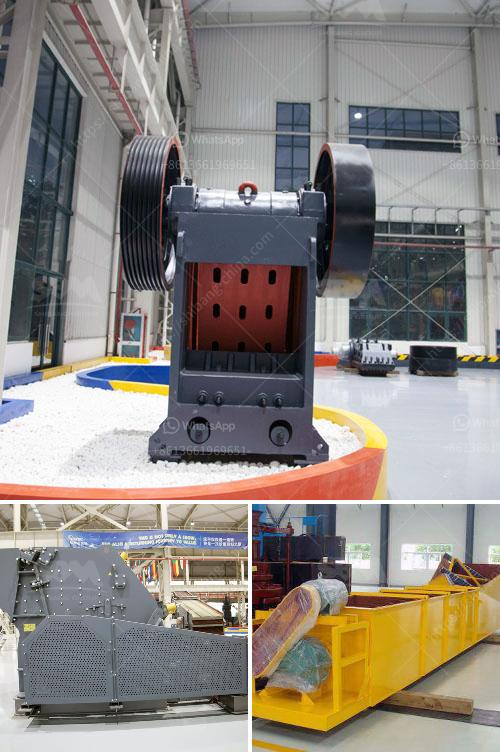

<h3>5mm limestones grinding to powder</h3>
Limestone is a sedimentary rock consisting mainly of calcium carbonate. It has various uses across different industries due to its versatility and durability. In recent years, the demand for limestones in powdered form has seen a significant increase. This rise in demand has paved the way for various techniques to grind limestones into fine powder, as small as 5mm. In this article, we will explore the grinding process and its benefits.

Grinding limestone to powder involves a series of processes. Initially, the limestone rocks are broken down into smaller pieces by primary crushers. These smaller rocks, typically measuring 5mm in size, then undergo further crushing in secondary crushers to create a fine powder. 

One of the most commonly used methods for grinding limestone is through the use of a ball mill. A ball mill is a cylindrical machine that rotates horizontally to perform the grinding process. The limestone, along with water and grinding media, are fed into the ball mill, which then pulverizes the limestone into a fine powder.

Grinding limestone into powder offers several advantages. Firstly, powdered limestone has increased surface area compared to larger particles. This increased surface area allows for better and more efficient chemical reactions. It is commonly used as a filler in many industries due to its ability to easily mix with other materials, providing cohesion and strength.

The powdered limestone is widely used in the construction industry as it can be added to cement to act as a binder and enhance its durability. The fine particles of limestone fill the gaps between cement particles, reducing shrinkage and increasing the overall strength of the final concrete product. Additionally, the powdered limestone helps in improving the workability of the concrete, making it easier to pour and shape.

In the agricultural sector, powdered limestone is commonly used as a soil conditioner. The fine particles help to neutralize acidic soils, reducing the acidity levels and creating a more balanced pH. This pH adjustment improves soil health and promotes better nutrient absorption by plants. It also enhances water penetration and reduces soil erosion.

Furthermore, powdered limestone finds applications in the paint industry. When added to paint formulations, it acts as a filler, improving the consistency and texture of the paint. It also enhances the opacity and coverage of pigments, giving a smoother and more refined finish to painted surfaces.

Beyond construction, agriculture, and paint industries, powdered limestone is also utilized in various other sectors such as cosmetics, pharmaceuticals, and petrochemicals. Its versatility and wide range of applications make it a valuable commodity.

In conclusion, the process of grinding limestone rocks into fine powder, as small as 5mm, opens up a world of possibilities for numerous industries. The increased surface area and fine particles of the powdered limestone enhance its mechanical and chemical properties, making it highly sought after in construction, agriculture, paint, cosmetics, and other sectors. The demand for powdered limestone is expected to continue to rise as more industries discover its immense value and potential for innovation.
<h3>Contact us</h3><ul><li><strong>Whatsapp:&nbsp;<a href="https://wa.me/8613661969651">+8613661969651</a></strong></li><li><a href="https://swt.shibang-china.com/?git&amp;zhl&amp;5mm limestones grinding to powder"><strong>Online Service(chat now)</strong></a></li></ul><h3>Related</h3><ul><li><a href='micro powder grinding mill.md'>micro powder grinding mill</a></li><li><a href='low cost jaw crusher price in uganda.md'>low cost jaw crusher price in uganda</a></li><li><a href='land requirement for mini cement plant.md'>land requirement for mini cement plant</a></li><li><a href='grinding mills for sale in harare.md'>grinding mills for sale in harare</a></li><li><a href='grinding plant improvement.md'>grinding plant improvement</a></li></ul>