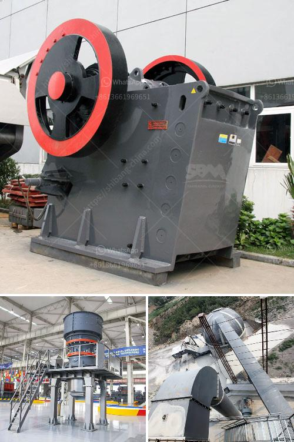

<h3>accessories for conveyor belts</h3>
Conveyor belts are an integral part of numerous industries, aiding in the smooth and efficient movement of materials across various stages of production. To maximize the effectiveness of conveyor systems, manufacturers offer a wide range of accessories that enhance their functionality, improve safety, and extend their lifespan.

One such accessory is the conveyor belt scraper. This tool is specifically designed to remove excess material and debris from the belt's surface, preventing buildup and potential blockages. By enhancing belt cleanliness, scrapers reduce the risk of premature wear and tear, ensuring a longer operational life and minimal downtime for maintenance.

Additionally, belt tracking systems contribute to conveyor belt efficiency. These accessories help maintain proper alignment throughout the conveyor system, preventing the belt from veering off course. Misalignment can lead to uneven material distribution and conveyor damage. Belt tracking systems use sensors and guides to detect and correct any deviations, optimizing conveyor performance and reducing product waste.

To address safety concerns, conveyor belts can be fitted with emergency stop switches. These switches are strategically placed along the conveyor line and can be triggered manually or automatically in the event of an emergency. Once activated, the stop switches halt conveyor operation almost instantly, preventing accidents and potential injuries. This accessory is crucial, especially in industries where workers interact closely with the conveyor belts, such as manufacturing and logistics.

For industries dealing with high-temperature materials or working environments, the use of heat-resistant conveyor belts is vital. These belts are specifically engineered to withstand extreme heat, ensuring their integrity and minimizing the risk of belt failure. Accessories like heat-resistant rollers and pulleys further enhance the overall belt performance and longevity, as they can withstand the detrimental effects of heat exposure.

Another important accessory is the belt fastener. This component ensures a secure connection between the ends of the conveyor belt, preventing any separation or slippage during operation. Belt fasteners are available in various designs, including mechanical and vulcanized options, offering flexibility for different belt configurations. Choosing the right fastener is essential to maintain belt integrity and minimize production disruptions caused by belt detachment.

In some industries, conveyor belts transport materials that are prone to spillage or dust generation. To address these challenges, manufacturers provide belt sealing systems that minimize material leakage and airborne particles. Sealing accessories, such as belt skirting, prevent spillage along the belt edges, while dust containment systems capture and control airborne particles, protecting workers' health and maintaining a clean working environment.

Other popular accessories include belt scales for accurate weight measurement, idler frames for supporting and guiding the belt, and conveyor belt guards for protecting workers from moving components. Each accessory contributes to the overall efficiency and safety of the conveyor system, ensuring optimal performance and reducing potential risks.

In conclusion, accessories for conveyor belts are indispensable in improving conveyor efficiency and safety across various industries. From belt scrapers to emergency stop switches, each accessory addresses different challenges and enhances conveyor functionality. By investing in the right accessories, companies can optimize their conveyor systems, improve productivity, and establish a safer working environment.
<h3>Contact us</h3><ul><li><strong>Whatsapp:&nbsp;<a href="https://wa.me/8613661969651">+8613661969651</a></strong></li><li><a href="https://swt.shibang-china.com/?git&amp;zhl&amp;accessories for conveyor belts"><strong>Online Service(chat now)</strong></a></li></ul><h3>Related</h3><ul><li><a href='dubai dolomite crusher suppliers.md'>dubai dolomite crusher suppliers</a></li><li><a href='low cost jaw crusher price in uganda.md'>low cost jaw crusher price in uganda</a></li><li><a href='silica sand processing plant flowchart.md'>silica sand processing plant flowchart</a></li><li><a href='chrome washing machine plant eluvial mill gold.md'>chrome washing machine plant eluvial mill gold</a></li><li><a href='rent portable concrete crusher in los angeles.md'>rent portable concrete crusher in los angeles</a></li></ul>