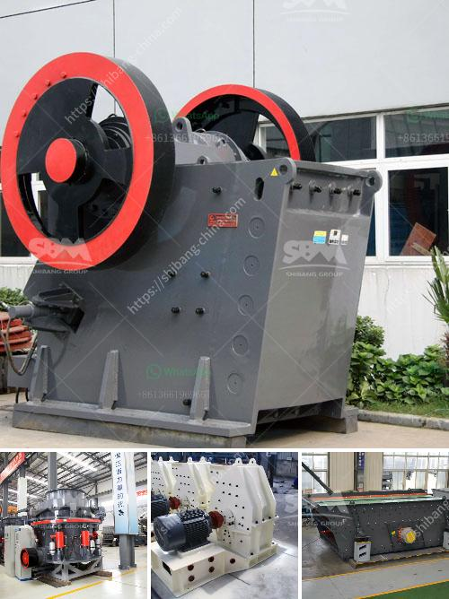

<h3>advance stone agregate crusher equipments</h3>
Advanced Stone Aggregate Crusher Equipments: Enhancing Efficiency and Productivity in the Construction Industry

In the construction industry, stone aggregate is essential for creating strong and durable structures. To produce high-quality aggregate, modern crushing equipment is crucial. Advanced stone aggregate crusher equipments are designed to ensure optimal efficiency and productivity, while reducing the overall cost of production.

One of the primary components of the advanced stone aggregate crusher equipment is the crusher itself. This powerful machine uses a combination of compressive force and impact to break down the stone into smaller pieces. With the increasing demand for smaller and more uniformly sized aggregates, crushers with advanced technology have been developed to meet these requirements.

The advanced crusher systems employ cutting-edge hydraulic and mechanical techniques to ensure efficient and precise crushing. These systems include adjustable settings that allow operators to customize the size and shape of the final product to meet specific project needs. Additionally, automatic control systems help regulate the crusher's functions, optimizing performance and minimizing downtime.

Another critical component of the advanced stone aggregate crusher equipment is the screening machinery. After the stone has been crushed, it is necessary to separate the different sizes to create the desired aggregate gradation. Advanced screening equipments can efficiently process large volumes of crushed stone, ensuring that only the desired sizes are sent for further processing.

Furthermore, modern stone crusher equipments are designed to be mobile and easily transported to different construction sites. This mobility allows for greater flexibility and cost-efficiency in the construction process. These advanced machines can be easily transported on-site and set up quickly to begin production promptly.

The use of advanced stone aggregate crusher equipments offers numerous benefits to the construction industry. These machines enhance efficiency, allowing for a higher production rate with reduced labor costs. They also minimize waste by producing the required aggregate sizes accurately, resulting in cost savings and improved sustainability.

Moreover, by utilizing advanced crusher equipment, construction companies can achieve a higher level of quality control. The uniform sizing of aggregates ensures consistent strength and stability in the structures built with them. Meeting these standardized specifications is essential for guaranteeing the longevity and safety of any project.

In conclusion, advanced stone aggregate crusher equipments have revolutionized the construction industry by significantly enhancing efficiency and productivity while reducing costs. These innovative machines offer customizable settings, automated controls, and precise screening capabilities. Their mobility further adds to their versatility, making them indispensable for construction projects of all scales. With the adoption of advanced technology, the construction industry can continue to improve its efficiency, quality, and sustainability.
<h3>Contact us</h3><ul><li><strong>Whatsapp:&nbsp;<a href="https://wa.me/8613661969651">+8613661969651</a></strong></li><li><a href="https://swt.shibang-china.com/?git&amp;zhl&amp;advance stone agregate crusher equipments"><strong>Online Service(chat now)</strong></a></li></ul><h3>Related</h3><ul><li><a href='limestone grinding and crushing.md'>limestone grinding and crushing</a></li><li><a href='ball mill 25 tons per hour price.md'>ball mill 25 tons per hour price</a></li><li><a href='advance stone agregate crusher equipments.md'>advance stone agregate crusher equipments</a></li><li><a href='rock crushers for sale ghana.md'>rock crushers for sale ghana</a></li><li><a href='cara mengelola debu crucher batu bara.md'>cara mengelola debu crucher batu bara</a></li></ul>