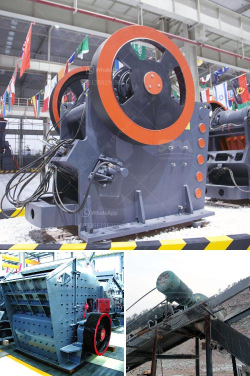

<h3>advantech grinding mill india</h3>
Grinding mills are an essential component in various industries, ranging from mining and construction to pharmaceuticals and chemicals. These mills are designed to grind solid materials into smaller particles or powders, which are then used for further processing or as final products. With the advancement of technology, grinding mills have also undergone a significant transformation. One such innovative solution is the Advantech grinding mill from India.

Advantech, a renowned Indian manufacturer and supplier of industrial equipment, has revolutionized the manufacturing industry with its state-of-the-art grinding mills. These mills offer numerous advantages over traditional grinding equipment, making them a preferred choice for numerous industries.

First and foremost, Advantech grinding mills are known for their superior efficiency. These mills are designed with precision and are equipped with high-performance motors and grinding chambers, ensuring maximum productivity and output. The advanced technology used in these mills allows for faster grinding and reduced processing time, thereby increasing overall production efficiency.

Apart from efficiency, Advantech grinding mills also offer exceptional versatility. These mills can effectively grind a wide range of materials, including minerals, ores, chemicals, and even food products, allowing for diverse applications across industries. Their adjustable grinding settings and interchangeable grinding plates make them suitable for achieving different particle sizes and consistency, catering to specific manufacturing requirements.

One of the significant advantages of Advantech grinding mills is their robust construction and durability. These mills are designed to withstand heavy-duty grinding operations, ensuring long-lasting performance even under challenging working conditions. The use of high-quality materials and advanced engineering techniques ensures minimal wear and tear, reducing maintenance requirements and overall operational costs.

Advantech grinding mills are also known for their user-friendly features and ease of operation. These mills come equipped with advanced control systems that allow for precise control over grinding parameters, ensuring consistent and desired results. Additionally, they are designed with safety features, such as emergency stop buttons and overload protection systems, ensuring a secure working environment for operators.

Another notable feature of Advantech grinding mills is their energy efficiency. These mills are designed to minimize energy consumption, reducing the carbon footprint of industries. The advanced motor technology and optimized grinding processes ensure efficient energy utilization while maintaining high productivity, making them an environmentally friendly choice for manufacturers.

In addition to the technological advancements, Advantech also offers excellent customer support and after-sales service. The company provides comprehensive training programs and technical assistance to ensure seamless integration and optimal utilization of their grinding mills. This commitment to customer satisfaction has earned Advantech a reputation for reliability and trustworthiness in the market.

In conclusion, the Advantech grinding mill from India has revolutionized the manufacturing industry with its array of innovative features and cutting-edge technology. These mills offer superior efficiency, versatility, durability, and energy efficiency, making them an ideal choice for various industries. With excellent customer support and after-sales service, Advantech has cemented its position as a leading provider of grinding mills, driving the growth and development of the manufacturing industry in India and beyond.
<h3>Contact us</h3><ul><li><strong>Whatsapp:&nbsp;<a href="https://wa.me/8613661969651">+8613661969651</a></strong></li><li><a href="https://swt.shibang-china.com/?git&amp;zhl&amp;advantech grinding mill india"><strong>Online Service(chat now)</strong></a></li></ul><h3>Related</h3><ul><li><a href='crusher allis cone chalmers mod 500.md'>crusher allis cone chalmers mod 500</a></li><li><a href='china roller grinding mill.md'>china roller grinding mill</a></li><li><a href='propel stone crusher.md'>propel stone crusher</a></li><li><a href='cone crusher spare parts.md'>cone crusher spare parts</a></li><li><a href='quarry equipment for sale in china.md'>quarry equipment for sale in china</a></li></ul>