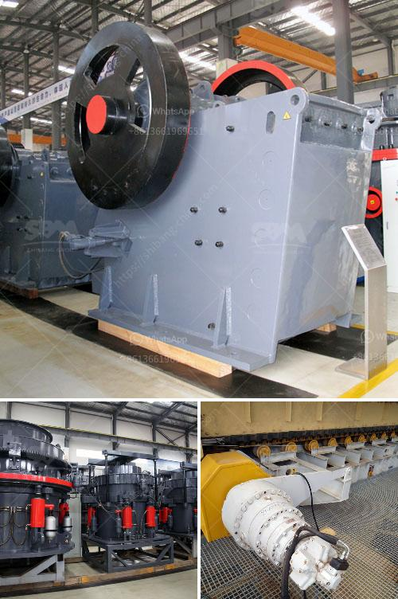

<h3>aggregate crushing processes</h3>
Aggregate crushing is the first step in the creation of construction materials. The process involves breaking down larger-sized materials into smaller, more manageable pieces in order to meet specifications for use in various construction projects.

The crushing process usually includes several stages, such as primary, secondary, and tertiary crushing. Primary crushing is typically done using jaw crushers or gyratory crushers, which extract the rock from the quarry or mine. Boulders as big as 1 to 1.5 meters in diameter are reduced to 150 millimeters or smaller.

After the primary crushing stage, the material is further processed through secondary or tertiary crushers. Secondary crushers are cone crushers or horizontal-shaft impact crushers that reduce the material to smaller sizes. Tertiary crushers are used to produce finely crushed material, such as sand or fine gravel, which is often used in asphalt mixtures.

During the crushing process, the material is fed into the crusher's chamber through a vibrating feeder. The chamber is lined with wear-resistant materials to mitigate wear from the crushing action. The material is then accelerated by the rotor, which impacts the stationary anvils or curtains inside the crusher. This impact breaks the material into smaller pieces. Another method of crushing involves compression, where the material is squeezed between two surfaces, such as jaw plates or mantle and concave surfaces in a cone crusher.

To ensure a high-quality end product, the crushed material must have a consistent size distribution, with minimal fines. Fines refer to particles smaller than the desired aggregate size. Excessive fines can decrease the strength and durability of the final product.

To control the particle size distribution, screening equipment is often used after the crushing process. Screens separate the crushed material into different size fractions, allowing for the production of various aggregate products. For example, a 20 mm screen will separate the material into two size fractions: 0-20 mm and >20 mm. The oversize material (>20 mm) can then be sent back to the crusher for further crushing.

Aggregate crushing plants often include conveyors to transport the material from one stage to another. In some cases, portable crushers are used, which can be easily moved to different locations within the quarry or mine site. This flexibility allows for efficient and cost-effective crushing operations, as the material is processed on-site.

Aggregate crushing is a crucial process in construction projects, as it provides the essential base material for infrastructure development. By breaking down larger-sized materials into smaller particles, aggregate crushing enables the production of various construction materials, such as concrete, asphalt, and road base. Therefore, understanding the aggregate crushing process is essential in delivering high-quality construction materials that meet industry standards.
<h3>Contact us</h3><ul><li><strong>Whatsapp:&nbsp;<a href="https://wa.me/8613661969651">+8613661969651</a></strong></li><li><a href="https://swt.shibang-china.com/?git&amp;zhl&amp;aggregate crushing processes"><strong>Online Service(chat now)</strong></a></li></ul><h3>Related</h3><ul><li><a href='jaw crusher buy in ukraine.md'>jaw crusher buy in ukraine</a></li><li><a href='china stone crusher closed circuit.md'>china stone crusher closed circuit</a></li><li><a href='barite crusher price.md'>barite crusher price</a></li><li><a href='crushed limestone for sale.md'>crushed limestone for sale</a></li><li><a href='gold mining equipment south africa.md'>gold mining equipment south africa</a></li></ul>