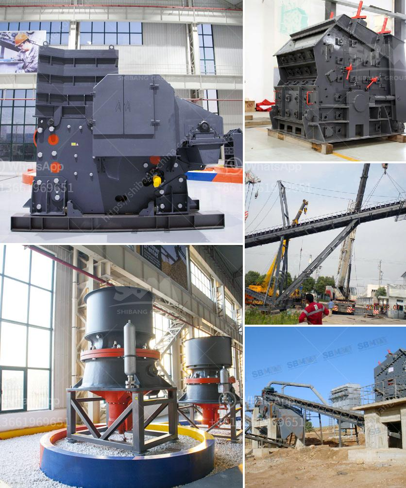

<h3>aggregate grinding mill manufacturers in south philippines</h3>
The demand for aggregates in the construction industry has been increasing in recent years, and with it, the need for efficient grinding equipment. A grinding mill is a machine that breaks large materials into smaller pieces, thus enabling efficient separation of these components for further processing. These machines are widely used in various industries, including mining, construction, and recycling.

In South Philippines, there are several manufacturers that offer grinding mills specifically designed for aggregate production. These manufacturers have extensive experience in the industry and are known for producing high-quality equipment that meets the specific requirements of their customers.

One of the leading manufacturers in South Philippines is Company X. They have a long history in the industry and are known for their innovative grinding mill designs. Their grinding mills are equipped with advanced technology, ensuring efficient and reliable operation. They offer a wide range of grinding mills, including ball mills, rod mills, and vertical mills, to meet the needs of different aggregate production applications.

Another prominent manufacturer in South Philippines is Company Y. They have a strong reputation for delivering reliable and durable grinding mills. Their mills are designed to handle large volumes of material while maintaining high grinding efficiency. They offer customizable solutions to meet the unique requirements of their customers, ensuring optimal performance and productivity.

Company Z is also a well-known manufacturer in South Philippines. They specialize in developing grinding mills that are designed for specific materials and applications. They have a team of experts who work closely with their customers to understand their needs and provide tailored solutions. Their grinding mills are known for their high-quality construction, ease of maintenance, and energy efficiency.

These manufacturers in South Philippines understand the importance of delivering reliable and efficient grinding mills to their customers. They invest heavily in research and development to continually improve their products and offer innovative solutions. They also provide excellent after-sales support, including technical assistance, spare parts availability, and maintenance services.

In conclusion, the demand for aggregates in the construction industry in South Philippines has increased the need for efficient grinding equipment. Several manufacturers in the region offer high-quality grinding mills specifically designed for aggregate production. These manufacturers have extensive experience in the industry and are known for delivering reliable and durable equipment. They invest in research and development to continually improve their products and offer innovative solutions. By choosing a reputable manufacturer, customers can ensure they receive a grinding mill that meets their specific requirements and delivers efficient and reliable operation.
<h3>Contact us</h3><ul><li><strong>Whatsapp:&nbsp;<a href="https://wa.me/8613661969651">+8613661969651</a></strong></li><li><a href="https://swt.shibang-china.com/?git&amp;zhl&amp;aggregate grinding mill manufacturers in south philippines"><strong>Online Service(chat now)</strong></a></li></ul><h3>Related</h3><ul><li><a href='ball mill for silica powder.md'>ball mill for silica powder</a></li><li><a href='crusher machine manufacturers in pakistan.md'>crusher machine manufacturers in pakistan</a></li><li><a href='ball mill 3 ton.md'>ball mill 3 ton</a></li><li><a href='grinding tools dealers in nigeria.md'>grinding tools dealers in nigeria</a></li><li><a href='gold refining and essay report equipment.md'>gold refining and essay report equipment</a></li></ul>