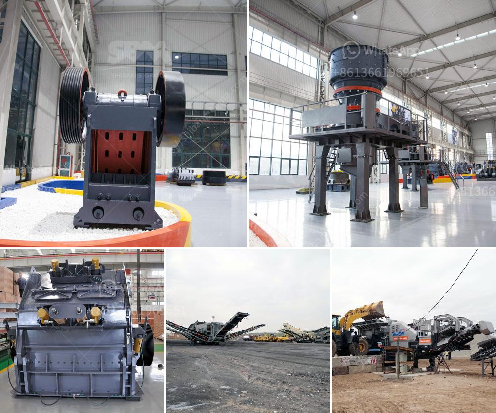

<h3>aggregate sand and gravel process in philippines</h3>
The Philippines is known for its rich natural resources. From pristine beaches and majestic mountains to fertile agricultural lands, the archipelago boasts a diverse ecosystem that supports various industries. One of these industries is the extraction and processing of aggregate sand and gravel.

Aggregate sand and gravel are essential materials in construction projects. They are used as the foundation for roads, bridges, buildings, and other infrastructure developments. The process of obtaining these materials involves extensive extraction and processing operations, which are crucial in meeting the growing demand for construction materials in the Philippines.

Quarrying is the primary method used to extract aggregate sand and gravel. It involves digging deep into the earth's surface to reach deposits of sand and gravel. These deposits may be located near riverbanks, hillsides, or mountains. Once the quarry site is identified, heavy machinery is brought in to remove the topsoil and expose the underlying sand and gravel.

The extracted materials are then transported to a processing plant where they undergo several stages of refinement. The process begins by separating the larger rocks and boulders from the sand and gravel using screens or sieves. This is followed by washing the materials to remove impurities such as dirt, clay, and organic matter.

After washing, the sand and gravel are further sorted and classified according to size. This is done using a process known as screening. The materials are passed through a series of screens with different-sized openings, allowing them to be separated into various grades. The different grades are then stored in separate stockpiles.

Quality control is an important aspect of the process. The aggregates are tested for their physical properties such as particle size distribution, shape, and texture. These tests ensure that the materials meet the required specifications for specific construction applications. For example, fine sand is suitable for mortar and plaster, while coarser gravel is used for road construction.

Once the aggregates are processed and tested, they are ready to be delivered to customers. Construction companies, contractors, and individual consumers purchase these materials for their projects. The transportation of aggregate sand and gravel is typically done using trucks or barges, depending on the location and accessibility of the project site.

The extraction and processing of aggregate sand and gravel play a vital role in the Philippine construction industry. It provides the necessary materials needed to build and develop the country's infrastructure. However, it is crucial to ensure that these operations are conducted in a sustainable and responsible manner.

Environmental considerations should be prioritized to minimize the negative impact on ecosystems and nearby communities. Measures such as proper site rehabilitation, reforestation, and dust control should be implemented. Additionally, strict compliance with environmental regulations and permits is necessary to prevent excessive disruption to natural habitats and water sources.

In conclusion, the extraction and processing of aggregate sand and gravel in the Philippines are essential in meeting the demand for construction materials. The quarrying process involves excavation, washing, screening, and quality control to produce aggregates of various grades. Nonetheless, it is crucial to conduct these operations responsibly and sustainably to protect the environment and ensure the longevity of natural resources.
<h3>Contact us</h3><ul><li><strong>Whatsapp:&nbsp;<a href="https://wa.me/8613661969651">+8613661969651</a></strong></li><li><a href="https://swt.shibang-china.com/?git&amp;zhl&amp;aggregate sand and gravel process in philippines"><strong>Online Service(chat now)</strong></a></li></ul><h3>Related</h3><ul><li><a href='rubber conveyor belt pdf.md'>rubber conveyor belt pdf</a></li><li><a href='gypsum crushing process.md'>gypsum crushing process</a></li><li><a href='ball mill small for sale.md'>ball mill small for sale</a></li><li><a href='marble quarry mining in sudan.md'>marble quarry mining in sudan</a></li><li><a href='stone crusher plant cost.md'>stone crusher plant cost</a></li></ul>