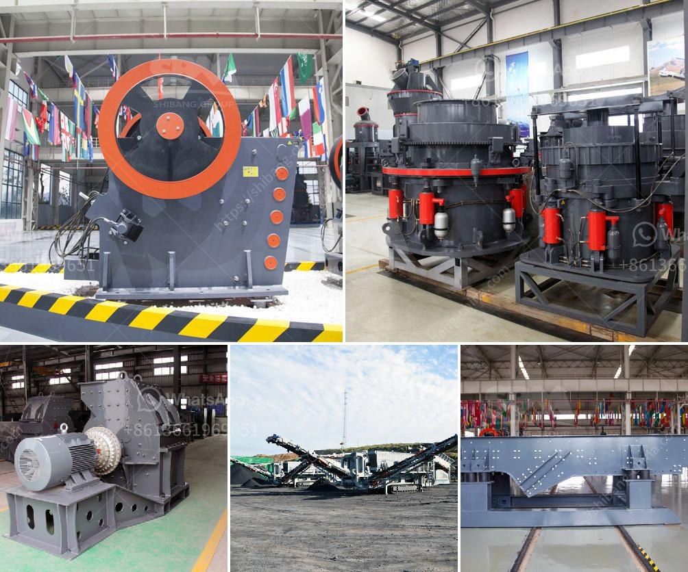

<h3>aggregate screens and crushers</h3>
In the fast-paced world of construction, time is of the essence. Efficiency and productivity are key factors that determine the success and profitability of a construction project. One essential tool that contributes to these factors is aggregate screens and crushers.

Aggregate screens and crushers are used to break down and separate rocks, gravel, and other aggregate materials for use in construction applications. These equipment pieces are designed to help improve the efficiency and productivity of construction sites by reducing the need for manual labor and ensuring a consistent quality of materials.

One of the main benefits of using aggregate screens and crushers is their ability to separate and sort materials according to size. This process is crucial in construction projects, as it allows for the use of different sizes of aggregate materials in specific areas of a building site. For example, fine aggregate materials can be used for concrete production, while larger stones can be used for road construction.

The efficiency of aggregate screens and crushers lies in their ability to handle a wide range of materials. From gravel and sand to crushed rocks and demolition waste, these machines can process various types of aggregates with ease. This versatility eliminates the need for multiple equipment pieces and allows for a streamlined workflow on construction sites.

Another advantage of aggregate screens and crushers is their ability to reduce manual labor. In traditional construction practices, workers had to manually break down rocks and separate them based on size. This process was time-consuming and labor-intensive. With the use of modern aggregate screens and crushers, this manual labor is significantly reduced, allowing workers to focus on more skilled tasks.

Not only do aggregate screens and crushers save time and reduce manual labor, but they also ensure a consistent quality of materials. These machines are equipped with advanced screening and crushing mechanisms that guarantee a uniform size distribution of aggregates. This consistency is critical in construction projects, as it ensures the strength and durability of structures.

In addition to enhancing efficiency and productivity on construction sites, aggregate screens and crushers also contribute to environmental sustainability. By reducing the need for manual labor and optimizing the use of aggregate materials, these machines help in minimizing waste and conserving natural resources.

When choosing aggregate screens and crushers for a construction project, it is essential to consider factors such as capacity, mobility, and durability. Different types and sizes of screens and crushers are available in the market, each designed to suit specific construction needs. It is crucial to select equipment that can efficiently handle the required workload and withstand the harsh conditions of a construction site.

In conclusion, aggregate screens and crushers are indispensable tools in the construction industry. They enhance efficiency and productivity by reducing the need for manual labor, ensuring a consistent quality of materials, and optimizing the use of aggregates. By investing in these machines, construction companies can streamline their operations, save time and costs, and contribute to sustainable construction practices.
<h3>Contact us</h3><ul><li><strong>Whatsapp:&nbsp;<a href="https://wa.me/8613661969651">+8613661969651</a></strong></li><li><a href="https://swt.shibang-china.com/?git&amp;zhl&amp;aggregate screens and crushers"><strong>Online Service(chat now)</strong></a></li></ul><h3>Related</h3><ul><li><a href='construction of roller mill.md'>construction of roller mill</a></li><li><a href='dolomite processing plant cost in india.md'>dolomite processing plant cost in india</a></li><li><a href='quarry plant solutions.md'>quarry plant solutions</a></li><li><a href='barite grinding plants.md'>barite grinding plants</a></li><li><a href='tonne stone crusher price for hire in cardiff.md'>tonne stone crusher price for hire in cardiff</a></li></ul>