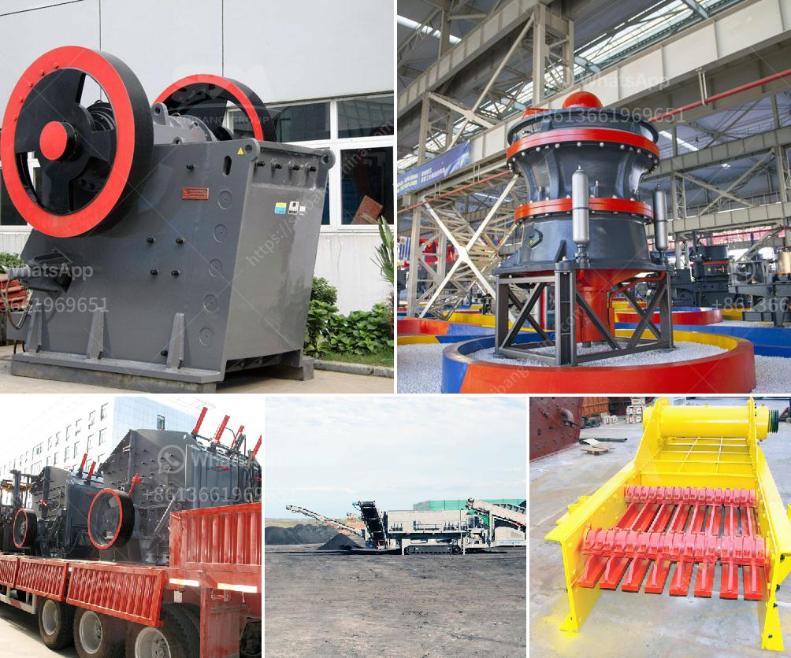

<h3>aggregate screens for sale</h3>
Aggregate screens are an essential part of the construction and mining industries. These screens play a vital role in separating and sorting materials based on their size and composition, making them crucial equipment for processing aggregates on construction sites, quarries, and mines. If you are in the market for aggregate screens, we have compiled a comprehensive guide on what to consider and where to find quality screens for sale.

Firstly, it is essential to understand the importance of aggregate screens in the construction and mining processes. These screens are designed to handle large amounts of material, efficiently separating them into various sizes for different applications. By using the appropriate screen size, construction teams and mining operators can ensure uniformity in their aggregates, resulting in stronger and more reliable structures. Aggregate screens help to remove impurities, such as rocks, debris, and unwanted materials, from the aggregate mix, further enhancing the quality of the final product.

When searching for aggregate screens for sale, it is crucial to consider specific factors to make an informed decision. Firstly, evaluate the size and capacity requirements of the project you are working on. The screen size and capacity should align with the volume and type of material you expect to process. Additionally, examine the screen's durability, considering the abrasive nature of aggregate processing. Look for screens made from high-quality materials that can withstand the demands of continuous use.

Another aspect to consider is the type of screen you need for your application. There are various types of screens available, including inclined vibrating screens, horizontal screens, and multi-slope screens. Each type has its own advantages and is suitable for different applications. Inclined vibrating screens, for example, are commonly used for aggregate sizing and dewatering, while horizontal screens are ideal for scalping and moisture content control. Understanding your specific needs will help you choose the right type of screen for your application.

Once you have determined your requirements, it is time to find aggregate screens for sale. Start by researching reputable suppliers and manufacturers with a track record of providing quality equipment. Look for companies that specialize in aggregate processing equipment, as they are likely to offer a wide range of screens catering to different needs. Online marketplaces, industry trade shows, and specialized equipment dealers are good places to find both new and used aggregate screens.

When considering used screens, thoroughly inspect them for any signs of wear and tear. Check the screens' structural integrity, moving parts, and overall condition. It may also be beneficial to inquire about the equipment's maintenance history and any warranties or guarantees provided. Purchasing from a reputable seller will give you peace of mind knowing that you are investing in a reliable and functioning piece of equipment.

In conclusion, aggregate screens are essential tools for the construction and mining industries. They aid in the efficient processing and separation of aggregates, improving the quality and uniformity of the final product. When looking for aggregate screens for sale, carefully assess your project's requirements, consider the type of screen needed, and research reputable suppliers. By doing so, you can find the perfect screen to suit your needs, ensuring efficient and reliable aggregate processing.
<h3>Contact us</h3><ul><li><strong>Whatsapp:&nbsp;<a href="https://wa.me/8613661969651">+8613661969651</a></strong></li><li><a href="https://swt.shibang-china.com/?git&amp;zhl&amp;aggregate screens for sale"><strong>Online Service(chat now)</strong></a></li></ul><h3>Related</h3><ul><li><a href='roller crusher brick making machine.md'>roller crusher brick making machine</a></li><li><a href='power draw calculator of ball mill.md'>power draw calculator of ball mill</a></li><li><a href='crushing plant coal machine.md'>crushing plant coal machine</a></li><li><a href='iron ore mines buyers in india.md'>iron ore mines buyers in india</a></li><li><a href='pulverizer machine dealers in cuttack.md'>pulverizer machine dealers in cuttack</a></li></ul>