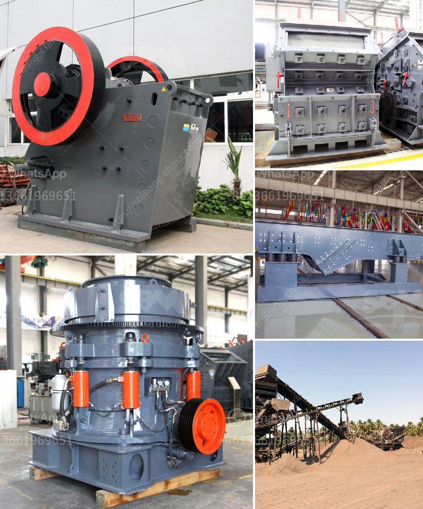

<h3>aggregate washing plant for sale</h3>
When it comes to building materials, aggregate is an essential component. Aggregate, often simply referred to as gravel, is a crucial element in the construction industry. It is used in various applications, such as road construction, concrete production, and even landscaping. With the increasing demand for aggregate, manufacturers have introduced innovative equipment like aggregate washing plants to process and clean the material efficiently.

An aggregate washing plant is an advanced piece of machinery that enables the washing and separation of impurities from the aggregates. It operates on a simple yet effective principle by using water and gravity. The plant consists of a hopper, a vibrating screen, a rotating drum scrubber, and a wheel sand washer. These components work together to remove clay, silt, dirt, and other impurities from the raw aggregate.

One of the primary advantages of using an aggregate washing plant is the improved quality of the final product. By removing impurities, the plant ensures that the aggregates meet the required specifications for various applications. Clean and properly graded aggregate enhances the strength and durability of structures. It also enables the production of high-quality concrete, which is vital for constructing safe and sturdy buildings.

Moreover, an aggregate washing plant significantly reduces environmental impact. Water conservation is a critical aspect of the operation, and the plant is designed to minimize water usage. The recycled water from the process can be reused multiple times, leading to more sustainable practices. In addition, the plant prevents the discharge of harmful contaminants into nearby water bodies, protecting the ecosystem and complying with environmental regulations.

Investing in an aggregate washing plant offers numerous benefits for businesses in the construction industry. It maximizes the production of clean aggregate, which in turn increases profitability. The plant enables companies to produce a variety of aggregate sizes, catering to different customer requirements. The versatility of the plant ensures that it can process a wide range of materials, including limestone, granite, and sandstone.

Furthermore, an aggregate washing plant enhances operational efficiency. It automates the washing process, reducing the need for manual labor and minimizing the chances of human error. The plant is designed for easy maintenance and has a robust construction, ensuring smooth operations and longevity. As a result, companies can save time, reduce costs, and streamline their production processes.

For businesses looking to purchase an aggregate washing plant, there are several options available in the market. Manufacturers offer a range of plants with different capacities and specifications to meet specific needs. It is essential to choose a plant that is reliable, efficient, and suits the production requirements. The cost of the plant may vary depending on its capacity and additional features, but the long-term benefits outweigh the initial investment.

Overall, an aggregate washing plant is a valuable asset for companies in the construction industry. It provides a sustainable and efficient solution for processing raw materials, ensuring high-quality aggregate for various applications. Investing in a reliable plant can significantly enhance productivity, promote environmental responsibility, and contribute to the success of construction projects.
<h3>Contact us</h3><ul><li><strong>Whatsapp:&nbsp;<a href="https://wa.me/8613661969651">+8613661969651</a></strong></li><li><a href="https://swt.shibang-china.com/?git&amp;zhl&amp;aggregate washing plant for sale"><strong>Online Service(chat now)</strong></a></li></ul><h3>Related</h3><ul><li><a href='impact crusher equipment.md'>impact crusher equipment</a></li><li><a href='crusher made in taiwan.md'>crusher made in taiwan</a></li><li><a href='ball mills mfg in kenya.md'>ball mills mfg in kenya</a></li><li><a href='stone crusher made in malaysia.md'>stone crusher made in malaysia</a></li><li><a href='machine powder gypsum mill.md'>machine powder gypsum mill</a></li></ul>