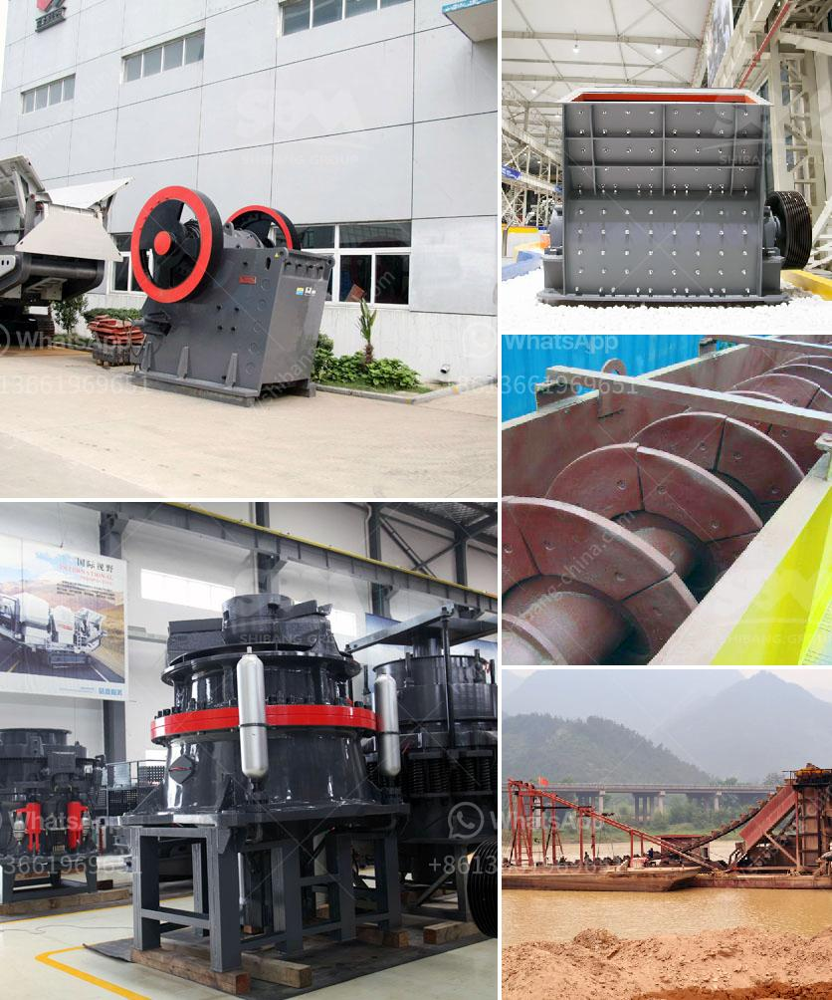

<h3>allis chalmers gyratory crushers</h3>
Allis Chalmers is a well-known brand that originated in Milwaukee, Wisconsin in the early 1900s. It has been a major player in the mining industry due to its wide array of heavy-duty machinery and equipment, especially its gyratory crushers. These crushers are widely used for crushing rocks and other hard materials in both underground and surface mining operations.

The Allis Chalmers gyratory crusher features a robust design and powerful crushing capabilities, making it a perfect choice for high-capacity crushing operations. It is equipped with a hydraulic setting adjustment system, which allows adjusting the crusher settings to fully match the material, feed size, and capacity requirements. This ensures optimal productivity and reduced downtime.

One of the key features of the Allis Chalmers gyratory crusher is its ability to ensure continuous, trouble-free operation even in demanding environments. It comes with a unique combination of high-quality materials and advanced engineering concepts, making it highly reliable and durable. The solid steel structure enhances the crusher's overall strength and stability, while the innovative design of the crushing chamber promotes efficient material breakage.

Another noteworthy aspect of the Allis Chalmers gyratory crusher is its versatility. It can handle various types of materials, ranging from soft and medium-hard rocks to extremely hard ores and minerals. The crusher's superior design allows it to handle both coarse and fine crushing applications, making it suitable for a wide range of mining operations.

The Allis Chalmers gyratory crusher's proactive maintenance practices are also worth mentioning. This crusher is equipped with an automatic lubrication system that ensures consistent lubrication of the mainshaft bearings, minimizing wear and reducing the risk of premature failures. Furthermore, regular maintenance inspections and routine servicing can be conducted easily, thanks to the crusher's accessible design.

Over the years, Allis Chalmers gyratory crushers have proven their effectiveness in various mining settings. They have been extensively used in both open-pit and underground mines, and their reliability and durability have made them a popular choice among mining operators. These crushers have played a crucial role in processing different types of minerals, such as copper, iron ore, gold, and more.

In conclusion, the Allis Chalmers gyratory crusher provides a great combination of productivity, reliability, and durability. Its robust design, powerful crushing capabilities, and versatile nature make it suitable for a wide range of mining operations. Whether it is crushing hard rocks or processing ores, the Allis Chalmers gyratory crusher is a reliable choice that can simplify your mining process and increase your productivity.
<h3>Contact us</h3><ul><li><strong>Whatsapp:&nbsp;<a href="https://wa.me/8613661969651">+8613661969651</a></strong></li><li><a href="https://swt.shibang-china.com/?git&amp;zhl&amp;allis chalmers gyratory crushers"><strong>Online Service(chat now)</strong></a></li></ul><h3>Related</h3><ul><li><a href='stone crushing machines for brick making.md'>stone crushing machines for brick making</a></li><li><a href='top mobile crusher.md'>top mobile crusher</a></li><li><a href='how to make good with limestone powder.md'>how to make good with limestone powder</a></li><li><a href='mobile crusher plant supplier in the philippines.md'>mobile crusher plant supplier in the philippines</a></li><li><a href='harga mobile crusher in indonesia.md'>harga mobile crusher in indonesia</a></li></ul>