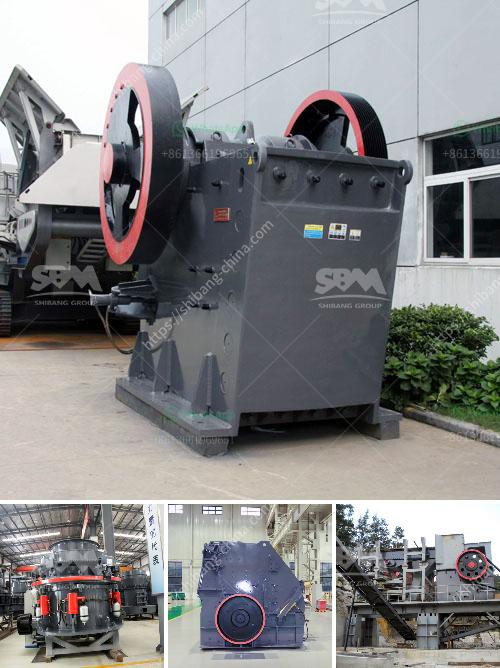

<h3>alluvial chrome wash plant</h3>
Chrome is a metal known for its brilliant shine and durability, making it a popular choice for various applications such as decorative finishes, automotive parts, and industrial equipment. Consequently, chrome mining has become a lucrative business, with the demand for this metal continuously on the rise. One of the essential components of chrome mining operations is the alluvial chrome wash plant.

An alluvial chrome wash plant is a chrome recovery plant that uses the principle of gravity to separate chrome particles from the sediment. It utilizes different particle size and density, allowing chrome particles to be separated efficiently and effectively. This type of plant is particularly suitable for chrome ore deposits located in rivers, streams, or other water bodies.

The alluvial chrome wash plant consists of several different stages or processes for chrome ore beneficiation, including crushing, grinding, primary separation, and secondary separation. Each stage involves a different set of equipment to achieve the desired outcome.

Firstly, the chrome ore is crushed into smaller particles to facilitate further processing. It is then ground into a fine powder using specialized equipment such as ball mills or rod mills. This process helps to release valuable chrome particles from the ore and prepare it for the subsequent separation stages.

The primary separation stage involves using gravity-based methods to separate chrome particles from the finer sediment. This is typically done using jigs or spirals that utilize the difference in particle size and density. Coarse chrome particles are collected and transferred to the next stage, while the lighter sediment is discarded.

In the secondary separation stage, various techniques such as magnetic separation or the use of shaking tables are employed to further separate and refine the chrome particles. This helps to increase the purity and grade of the chrome concentrate.

1. Cost-effective: Alluvial chrome wash plants are generally more cost-effective compared to underground mining operations. By harnessing the power of gravity and using minimal machinery, these plants offer a cost-efficient solution for chrome recovery.

2. Environmentally friendly: Since alluvial chrome wash plants primarily utilize gravity-based techniques, they typically involve less water consumption and produce fewer environmental impacts compared to other processing methods used in chrome mining.

3. High recovery rates: Alluvial chrome wash plants have demonstrated high recovery rates, which means that a significant portion of the chrome in the ore can be successfully recovered and utilized. This allows for better resource utilization and increased profitability.

In conclusion, alluvial chrome wash plants are an essential component of chrome mining operations. They employ gravity-based separation methods to recover chrome particles from sediment, offering a cost-effective and environmentally friendly solution. With their high recovery rates and ability to operate in various chrome ore deposits, these plants play a crucial role in meeting the growing global demand for chrome.
<h3>Contact us</h3><ul><li><strong>Whatsapp:&nbsp;<a href="https://wa.me/8613661969651">+8613661969651</a></strong></li><li><a href="https://swt.shibang-china.com/?git&amp;zhl&amp;alluvial chrome wash plant"><strong>Online Service(chat now)</strong></a></li></ul><h3>Related</h3><ul><li><a href='ball mill 100tph catalog.md'>ball mill 100tph catalog</a></li><li><a href='copper mining machine.md'>copper mining machine</a></li><li><a href='price list coal crusher plant 1500 ton hour.md'>price list coal crusher plant 1500 ton hour</a></li><li><a href='machine to crush stones for gold from germany.md'>machine to crush stones for gold from germany</a></li><li><a href='jaw crusher routine service pdf.md'>jaw crusher routine service pdf</a></li></ul>