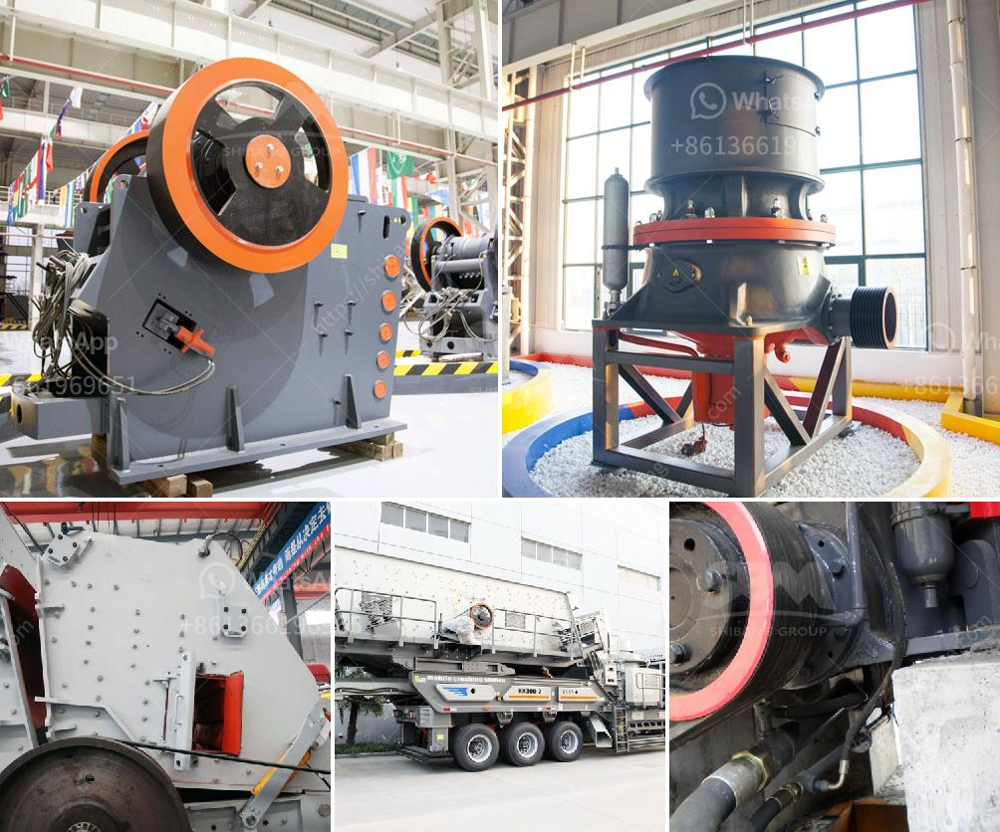

<h3>amenagement de station de concassage de 300 tonnes</h3>
L'aménagement d'une station de concassage de 300 tonnes est essentiel pour les entreprises du secteur minier et de la construction qui traitent de grandes quantités de matériaux. Une telle station permet de concasser des pierres, du gravier, de l'asphalte et d'autres matériaux en utilisant des machines puissantes et spécialisées.

Lors de la planification de l'aménagement d'une telle station, plusieurs aspects doivent être pris en compte. Tout d'abord, il est important de choisir un emplacement approprié pour la station de concassage. L'emplacement doit être proche des sources de matériaux, afin de réduire les coûts de transport et de minimiser les temps d'arrêt. De plus, il est essentiel de s'assurer que l'emplacement dispose d'une infrastructure adéquate pour le transport des matériaux.

Une fois l'emplacement choisi, la mise en place des machines de la station de concassage est la prochaine étape essentielle. Les machines doivent être disposées de manière à optimiser l'efficacité de la production. Il est recommandé de faire appel à des experts en génie mécanique pour concevoir la disposition des machines et s'assurer qu'elles fonctionnent de manière efficace.

Une station de concassage de 300 tonnes nécessite également un système de gestion des déchets approprié. Les déchets générés lors du processus de concassage peuvent être considérables, il est donc important d'avoir des systèmes en place pour collecter et éliminer les déchets conformément aux réglementations locales. Cela peut inclure l'utilisation de convoyeurs pour déplacer les déchets vers des zones de stockage désignées.

En ce qui concerne l'approvisionnement en énergie, une station de concassage de cette taille nécessite une alimentation électrique continue et fiable. Il est recommandé d'avoir une source d'alimentation de secours pour faire face aux éventuelles pannes de courant. En outre, il pourrait être judicieux d'envisager l'utilisation de sources d'énergie alternatives, telles que l'énergie solaire ou éolienne, afin de réduire les coûts opérationnels et l'empreinte carbone de la station.

Enfin, il est essentiel d'avoir un personnel qualifié et formé pour gérer efficacement la station de concassage. Le personnel doit être familiarisé avec les différentes machines utilisées et être en mesure de diagnostiquer et de résoudre rapidement les problèmes techniques. La sécurité est également une priorité, il est donc important de mettre en place des mesures de sécurité appropriées, telles que des protocoles d'entretien réguliers et des formations sur la sécurité.

En conclusion, l'aménagement d'une station de concassage de 300 tonnes est un processus complexe qui nécessite une planification minutieuse et l'intervention de divers experts. Lors de la conception de la station, des considérations telles que l'emplacement, la disposition des machines, la gestion des déchets et l'approvisionnement en énergie doivent être prises en compte. De plus, un personnel qualifié et formé est essentiel pour une gestion efficace de la station. En suivant ces étapes, les entreprises peuvent s'assurer que leur station de concassage fonctionnera de manière optimale et répondra à leurs besoins en matière de production de matériaux.
<h3>Contact us</h3><ul><li><strong>Whatsapp:&nbsp;<a href="https://wa.me/8613661969651">+8613661969651</a></strong></li><li><a href="https://swt.shibang-china.com/?git&amp;zhl&amp;amenagement de station de concassage de 300 tonnes"><strong>Online Service(chat now)</strong></a></li></ul><h3>Related</h3><ul><li><a href='model of raymound roller mill.md'>model of raymound roller mill</a></li><li><a href='uses of stone crusher equipment pdf.md'>uses of stone crusher equipment pdf</a></li><li><a href='sale 42 jaw crusher in india.md'>sale 42 jaw crusher in india</a></li><li><a href='primary jaw crusher.md'>primary jaw crusher</a></li><li><a href='crushing and screening costs.md'>crushing and screening costs</a></li></ul>