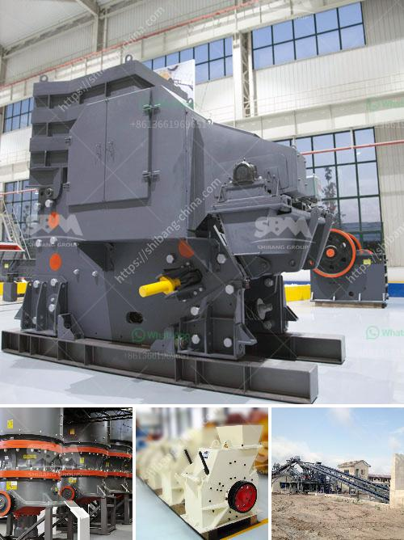

<h3>argentina hammer mills manufacturers</h3>
Hammer mills play a vital role in the agricultural industry, as they are used to grind grains and other agricultural products into smaller particles for animal feed or processing into other products. Argentina, a leading agricultural country, has a strong manufacturing sector that produces high-quality hammer mills to meet the growing demands of farmers and feed mills.

Argentina has a rich agricultural heritage, with vast fertile lands suitable for agricultural activities. The country is known for its production of crops such as soybeans, corn, wheat, and sunflowers. To efficiently process these crops and maximize their value, farmers and feed mills rely on robust and efficient hammer mills.

Fortunately, Argentina boasts numerous manufacturers specializing in the production of hammer mills, catering to the diverse needs of the agricultural industry. These manufacturers combine advanced technology with their extensive knowledge and experience to produce cutting-edge hammer mills that uphold the highest quality standards.

One such prominent manufacturer is ABC Machinery, a leading supplier of agricultural machinery in Argentina. With a legacy of more than 30 years, ABC Machinery has gained recognition for its reliable and innovative hammer mills. Their range of hammer mills is designed to cater to different farm sizes and applications, ensuring maximum productivity and efficiency.

ABC Machinery's hammer mills are built using high-quality materials, ensuring durability and longevity. The machines are equipped with robust hammers that effectively grind grains and agricultural products into fine particles. Additionally, their hammer mills come with customizable features, allowing farmers and feed mills to meet their specific processing requirements.

Another renowned manufacturer in Argentina is Molinos Agro, a leading competitor in the agricultural machinery market. Molinos Agro offers a wide range of hammer mills that can handle varying capacities, from small-scale farms to large-scale industrial applications. Combining state-of-the-art technology with industry expertise, their hammer mills deliver exceptional performance and reliability.

In recent years, Argentina's hammer mill manufacturers have embraced digitalization and automation, further revolutionizing the industry. Advanced features such as digital control panels, automatic feeding systems, and remote monitoring capabilities have simplified the operation of hammer mills, enhancing overall productivity and minimizing labor-intensive processes.

The ongoing technological advancements in the field have also paved the way for increased energy efficiency, reducing operational costs for farmers and feed mills. Manufacturers are incorporating energy-saving features into their hammer mills, making sustainable and eco-friendly practices more accessible.

Moreover, the synergy between Argentina's hammer mill manufacturers and the country's agricultural producers has created a thriving ecosystem. Manufacturers actively collaborate with farmers and feed mills to understand their evolving needs and challenges, contributing to the development of innovative hammer mills that cater to the specific demands of the Argentine agricultural sector.

In conclusion, Argentina's hammer mill manufacturers are making significant strides in revolutionizing the agricultural industry. Their commitment to producing robust and efficient hammer mills has empowered farmers and feed mills to enhance their productivity and maximize the value of their agricultural products. With continuous advancements in technology and a strong focus on sustainability, Argentina's hammer mill manufacturers are poised to play a crucial role in shaping the future of the agricultural industry both domestically and globally.
<h3>Contact us</h3><ul><li><strong>Whatsapp:&nbsp;<a href="https://wa.me/8613661969651">+8613661969651</a></strong></li><li><a href="https://swt.shibang-china.com/?git&amp;zhl&amp;argentina hammer mills manufacturers"><strong>Online Service(chat now)</strong></a></li></ul><h3>Related</h3><ul><li><a href='stone crusher equipment manufacturer made in canada.md'>stone crusher equipment manufacturer made in canada</a></li><li><a href='ballast making machine for sale.md'>ballast making machine for sale</a></li><li><a href='how much is a stone crusher.md'>how much is a stone crusher</a></li><li><a href='granite quarry plant in sri lanka.md'>granite quarry plant in sri lanka</a></li><li><a href='brazil best crusher manufacturing companies.md'>brazil best crusher manufacturing companies</a></li></ul>