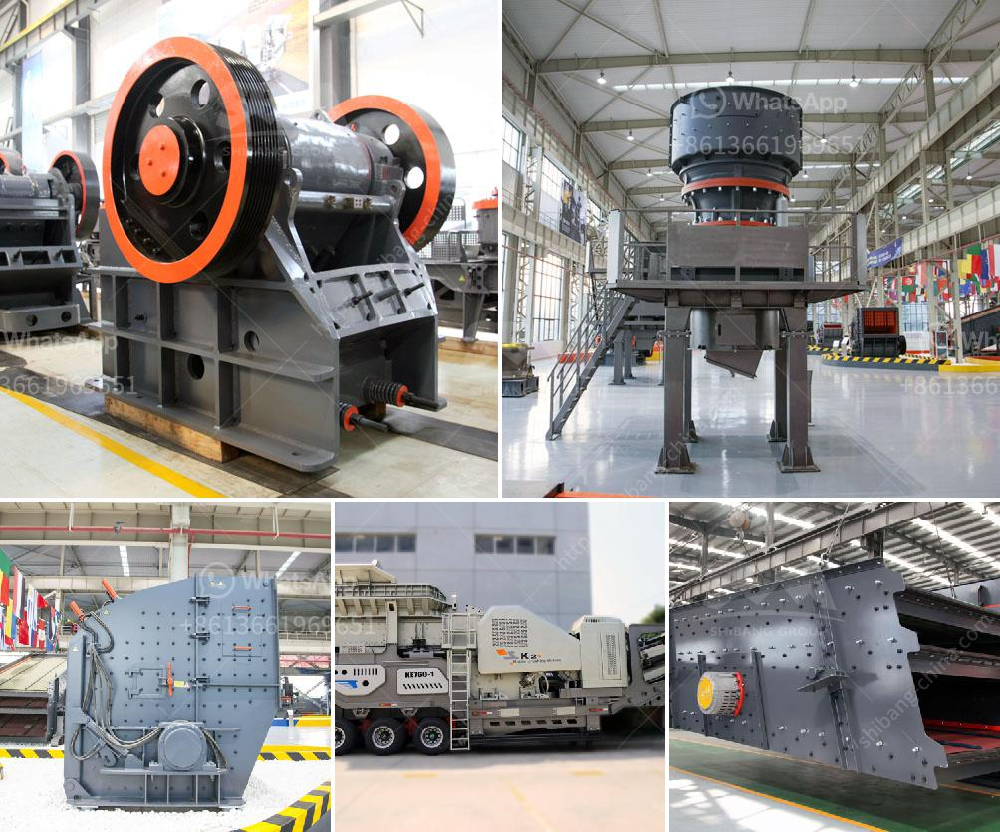

<h3>artificial plant quartz plant india</h3>
In recent years, artificial plants have gained immense popularity as a modern and hassle-free alternative to real plants. Among the wide range of artificial plants available in the market, the quartz plant has emerged as a sought-after choice for interior décor in India. With its realistic appearance, low maintenance, and durability, the quartz plant adds a touch of elegance and freshness to any space. Let's explore the reasons behind its growing popularity.

One of the key reasons why artificial quartz plants are in high demand is their lifelike appearance. Advanced manufacturing techniques have enabled the creation of artificial plants that mimic the texture, shape, and color of their real counterparts. The quartz plant, with its vibrant green leaves and slender stems, adds a touch of nature to any indoor space without the hassle of watering or pruning.

For individuals with busy schedules or those lacking a green thumb, artificial quartz plants offer a practical and time-saving solution. Unlike real plants, which require watering, fertilizing, and regular maintenance, artificial quartz plants retain their fresh and vibrant look for years with minimal effort. This makes them an ideal choice for homes, offices, hotels, or any space where time constraints or lack of expertise may hinder the growth of real plants.

Another advantage of using artificial quartz plants is their durability and longevity. Made from high-quality materials, these plants can withstand dust, sunlight, and fluctuations in temperature, ensuring their beauty remains intact for an extended period. Unlike real plants that may wither or die due to neglect or adverse conditions, artificial quartz plants bring lasting beauty to any space.

Artificial quartz plants have become a popular choice for interior decoration in India due to their realistic appearance, low maintenance, and long-lasting nature. With these plants, individuals can enjoy the beauty of nature without the hassle of regular care, making them a perfect addition to various settings. Whether it's a living room, hotel lobby, or office space, artificial quartz plants enhance the aesthetic appeal of any interior while promoting a sense of tranquility and calm.
<h3>Contact us</h3><ul><li><strong>Whatsapp:&nbsp;<a href="https://wa.me/8613661969651">+8613661969651</a></strong></li><li><a href="https://swt.shibang-china.com/?git&amp;zhl&amp;artificial plant quartz plant india"><strong>Online Service(chat now)</strong></a></li></ul><h3>Related</h3><ul><li><a href='used washing plant sale south africa.md'>used washing plant sale south africa</a></li><li><a href='impact crusher machine for sale.md'>impact crusher machine for sale</a></li><li><a href='crusher manufactures in europe.md'>crusher manufactures in europe</a></li><li><a href='raymond roller mill model 30 picture.md'>raymond roller mill model 30 picture</a></li><li><a href='calculation crusher plant cost.md'>calculation crusher plant cost</a></li></ul>