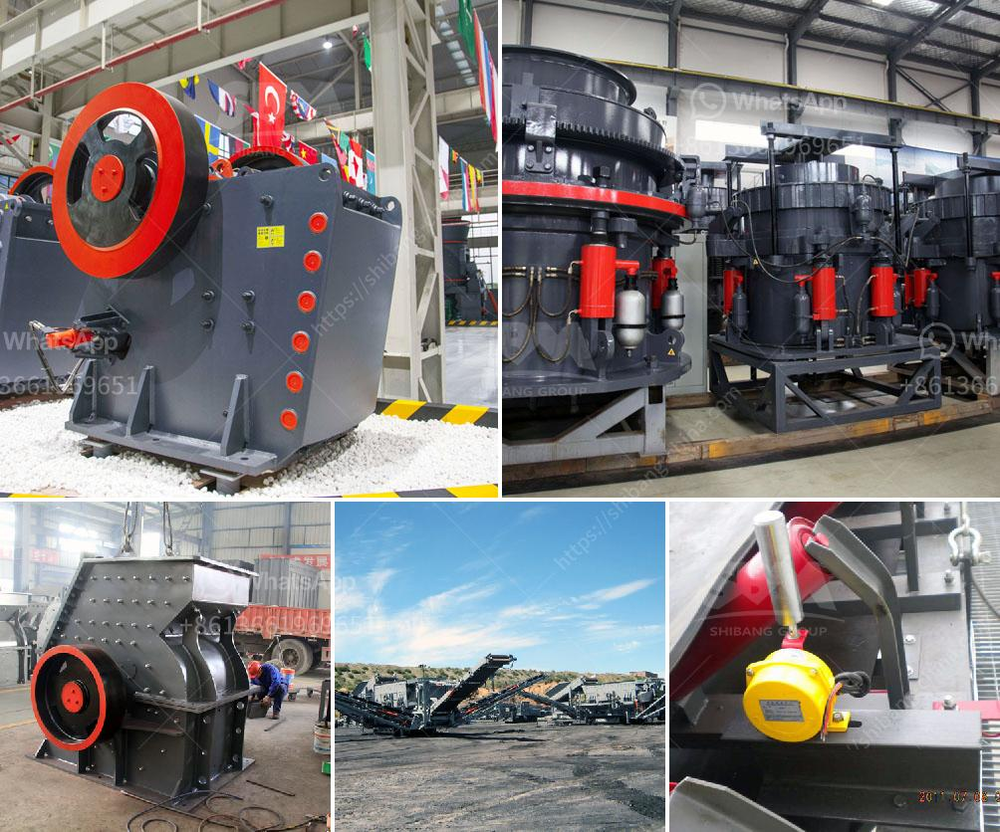

<h3>artificial sand making machines</h3>
Artificial sand is a newly emerged material in the construction industry. It is the result of crushing rocks, quarry stones or larger aggregate pieces into sand-sized particles for improving the quality of construction materials. Artificial sand is a cost-effective and sustainable alternative to natural sand. It offers a solution to increasing demand for sand, which is a finite and quickly depleting resource.

The rapid growth in urbanization and infrastructural development has led to a surge in the demand for sand. Sand is a key ingredient in the production of concrete, asphalt, and mortar used in construction activities. However, due to the excessive mining of riverbeds and depletion of sand reserves, there is a scarcity of natural sand in many regions. This has prompted researchers and engineers to develop artificial sand making machines to meet the growing demand.

Artificial sand making machines, also known as vertical shaft impact crushers, are mainly used in the aggregate and mining industries to reduce the size of rocks and stones into smaller sand-sized particles. These machines consist of a rotor with high-speed rotating shafts that throw the rocks against the anvils in the crushing chamber to break them down into smaller sizes.

1. Consistent quality: Unlike natural sand, which varies in quality and composition depending on the source, artificial sand has a consistent composition and quality. This makes it a reliable and standardized material for construction projects.

2. Cost-effective: Artificial sand is often cheaper than natural sand, as it can be produced locally using locally available resources. This reduces the transportation costs associated with importing natural sand from distant locations.

3. Environmentally friendly: Artificial sand production does not require the excavation of riverbeds or depleting natural resources. This reduces the ecological impact of sand mining and preserves the natural environment.

4. Customizable properties: The properties of artificial sand, such as its particle size, shape, and grading, can be tailored to meet specific construction requirements. This allows engineers to optimize the materials used in construction projects for better performance and durability.

5. Unlimited availability: Unlike natural sand, which is a finite resource, artificial sand can be produced in unlimited quantities. This ensures a steady supply of sand for construction projects, irrespective of the availability of natural sand.

Artificial sand making machines have become an essential tool in the construction industry, offering a sustainable alternative to natural sand. By reducing the demand for natural sand and preventing the ecological damage caused by sand mining, these machines are playing a crucial role in building a sustainable future.

As the demand for sand continues to rise, further advancements in artificial sand making technology are expected. Researchers are exploring different materials and techniques to enhance the properties of artificial sand and make it more suitable for various construction applications.

Overall, artificial sand making machines are a valuable solution to the growing demand for sand in the construction industry. They offer a cost-effective, environmentally friendly, and sustainable alternative to natural sand, ensuring a constant supply of quality sand for construction projects. With ongoing research and development, artificial sand making machines are set to become even more efficient and versatile in the future.
<h3>Contact us</h3><ul><li><strong>Whatsapp:&nbsp;<a href="https://wa.me/8613661969651">+8613661969651</a></strong></li><li><a href="https://swt.shibang-china.com/?git&amp;zhl&amp;artificial sand making machines"><strong>Online Service(chat now)</strong></a></li></ul><h3>Related</h3><ul><li><a href='sand making plant.md'>sand making plant</a></li><li><a href='roll crusher reduction ratio.md'>roll crusher reduction ratio</a></li><li><a href='stone crusher plant kapasitas 60 ton h.md'>stone crusher plant kapasitas 60 ton h</a></li><li><a href='low cost jaw crusher price in uganda.md'>low cost jaw crusher price in uganda</a></li><li><a href='portable hard rock mining.md'>portable hard rock mining</a></li></ul>