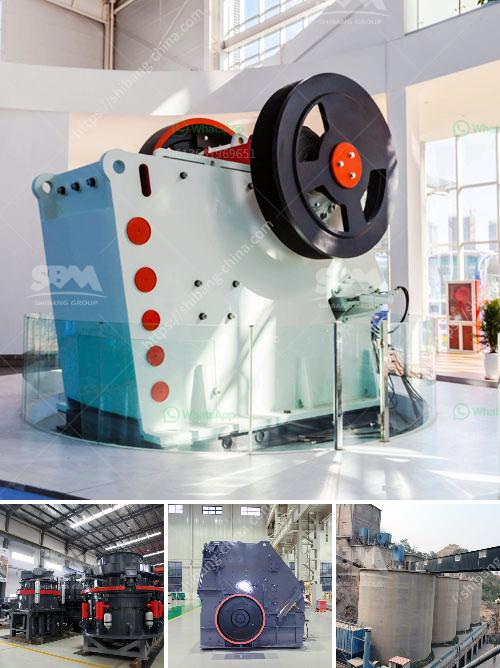

<h3>artificial stone manufacturing process</h3>
In recent years, the demand for artificial stone has been surging due to its versatility and cost-effectiveness. Artificial stone, also known as engineered stone or synthetic stone, is a composite material that is created by mixing quartz or marble particles with resins, pigments, and other additives. This innovative manufacturing process has revolutionized the construction industry, offering architects, designers, and homeowners a wide range of options while delivering excellent durability and aesthetic appeal.

The process of manufacturing artificial stone involves several key steps, starting with the selection and preparation of raw materials. The primary component of artificial stone is typically quartz or marble particles, which are carefully selected for their quality and consistency. These particles are then mixed with a resin binder, which serves as the adhesive that holds the stone together.

Once the raw materials are selected, they are mixed together in precise proportions in a mixing machine. This machine ensures that the particles are evenly distributed throughout the mixture, creating a homogenous blend. During this process, various additives such as pigments, fillers, and reinforcing agents may be included to enhance the stone's strength and appearance.

After the mixture is thoroughly mixed, it is poured into molds that have been previously prepared according to the desired shape and size of the artificial stone. The molds are then placed in a special vacuum chamber that removes any air bubbles or trapped gases from the mixture. This step ensures the structural integrity and quality of the final product.

Once the molds are vacuumed, they are transferred to a curing chamber where the mixture undergoes a controlled curing process. The curing process allows the resin binder to harden and solidify, transforming the mixture into a solid and durable stone-like material. The length of the curing process varies depending on the specific type of artificial stone being produced, and it may range from a few hours to several days.

After the curing process is complete, the artificial stones are carefully removed from the molds. They undergo a series of quality control checks to ensure that they meet the desired specifications and standards. Any imperfections, such as surface irregularities or color variations, are meticulously addressed and corrected.

The final step in the artificial stone manufacturing process involves polishing and finishing. This step enhances the stone's appearance and provides it with a smooth and glossy surface. Various techniques, such as grinding, sanding, and buffing, are employed to achieve the desired finish. Additionally, additional treatments, such as sealing or coating, may be applied to enhance the stone's durability and resistance to staining.

The manufacturing process of artificial stone offers numerous advantages over natural stone. Firstly, it allows for greater customization, as artificial stone can be made in a wide range of colors, patterns, and sizes. Secondly, artificial stone is more consistent in terms of quality and appearance, as it is not subject to natural variations like natural stone. Lastly, artificial stone is generally more affordable, making it an attractive option for budget-conscious consumers.

In conclusion, the manufacturing process of artificial stone has revolutionized the construction industry by providing an affordable, customizable, and durable alternative to natural stone. This innovative process has opened up a world of possibilities for architects, designers, and homeowners, enabling them to create stunning and functional spaces. As technology continues to advance, we can expect even more advancements in the field of artificial stone manufacturing.
<h3>Contact us</h3><ul><li><strong>Whatsapp:&nbsp;<a href="https://wa.me/8613661969651">+8613661969651</a></strong></li><li><a href="https://swt.shibang-china.com/?git&amp;zhl&amp;artificial stone manufacturing process"><strong>Online Service(chat now)</strong></a></li></ul><h3>Related</h3><ul><li><a href='mobile vibrating screens.md'>mobile vibrating screens</a></li><li><a href='how to make lime powder.md'>how to make lime powder</a></li><li><a href='4 inch marble grinder mill.md'>4 inch marble grinder mill</a></li><li><a href='suoer fine mill grinder.md'>suoer fine mill grinder</a></li><li><a href='stone crushers looking for partners.md'>stone crushers looking for partners</a></li></ul>