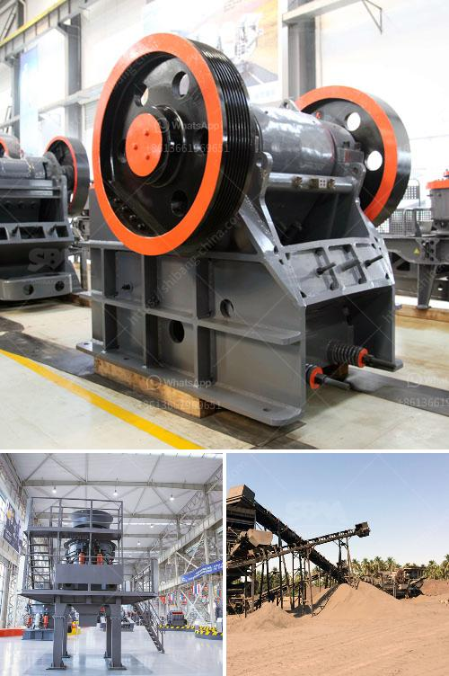

<h3>artificial stone production line floor</h3>
Artificial stone, also known as engineered stone or synthetic stone, has gained immense popularity in the flooring industry due to its durability, versatility, and aesthetic appeal. It is manufactured using a specialized production line, which ensures consistent quality, high strength, and an array of design options. Let’s delve deeper into the fascinating world of artificial stone production line flooring.

The production process of artificial stone begins with the careful selection of raw materials. These materials typically consist of natural minerals, such as quartz, granite, or marble, combined with resin and pigments. The exact combination of these elements can be adjusted to achieve specific desired characteristics, such as color, pattern, and texture.

Once the raw materials are collected, they are mixed together in precise ratios to create a homogeneous mixture. This mixture is then poured into molds, which can be of various sizes and shapes, depending on the specific flooring design required. The molds are carefully designed to ensure proper curing, strength, and the desired surface finish.

After pouring the mixture into the molds, it is placed in a specialized curing chamber where it undergoes a curing process. This process involves the application of heat and pressure, which helps to transform the mixture into a solid, durable, and long-lasting flooring material. The curing process can take several hours or even days, depending on the specific type of artificial stone being produced.

Once the curing process is complete, the molds are opened, and the newly formed artificial stone slabs or tiles are carefully removed. These slabs or tiles are then subjected to further finishing processes, including polishing, grinding, and sealing, to enhance their appearance and performance.

One of the key advantages of artificial stone production line flooring is its ability to replicate the natural beauty of traditional stones, such as granite or marble, while offering superior durability and resistance to wear and tear. Additionally, artificial stone is non-porous, making it resistant to stains, water damage, and bacteria growth. This makes it an ideal choice for high-traffic areas, such as kitchens and bathrooms, where hygiene is of utmost importance.

Moreover, artificial stone production line flooring offers an extensive range of design options, allowing homeowners and designers to choose from a wide variety of colors, patterns, and textures. This versatility enables artificial stone to seamlessly integrate into any interior design style, whether it be contemporary, traditional, or transitional.

In conclusion, the production line for artificial stone flooring is a sophisticated and meticulous process that results in a highly durable, aesthetically pleasing, and versatile flooring material. Its ability to mimic the natural beauty of traditional stones, combined with its exceptional durability and resistance to wear and tear, make it a preferred choice for homeowners and designers alike. Furthermore, its non-porous nature and wide range of design options make it an ideal flooring choice for high-traffic areas and a variety of interior styles. With its many advantages and outstanding performance, artificial stone production line flooring continues to revolutionize the flooring industry.
<h3>Contact us</h3><ul><li><strong>Whatsapp:&nbsp;<a href="https://wa.me/8613661969651">+8613661969651</a></strong></li><li><a href="https://swt.shibang-china.com/?git&amp;zhl&amp;artificial stone production line floor"><strong>Online Service(chat now)</strong></a></li></ul><h3>Related</h3><ul><li><a href='cement plant production line.md'>cement plant production line</a></li><li><a href='hydraulic roll crusher zenith.md'>hydraulic roll crusher zenith</a></li><li><a href='roller crusher brick making machine.md'>roller crusher brick making machine</a></li><li><a href='concrete batching plant for sale in pakistan.md'>concrete batching plant for sale in pakistan</a></li><li><a href='mobile crushing unit.md'>mobile crushing unit</a></li></ul>