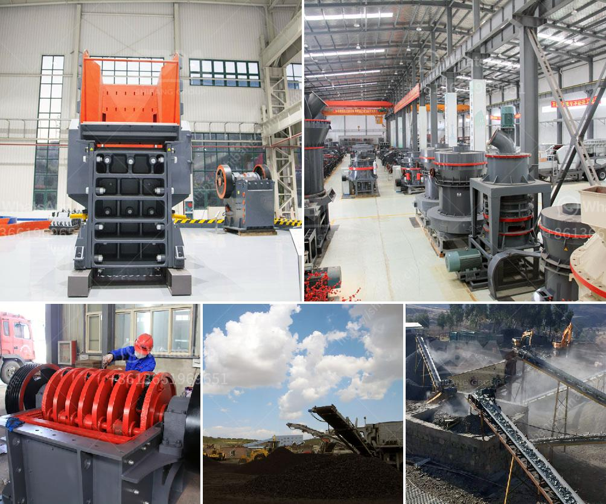

<h3>artificial stone production plant in turkey</h3>
Turkey has been a significant player in the construction industry, contributing to the nation's rapid urbanization and infrastructure development. In recent years, the country has witnessed a rising trend in the production of artificial stone, or engineered stone, which has revolutionized the architectural landscape. With the establishment of artificial stone production plants in Turkey, the construction sector is experiencing a remarkable transformation.

Artificial stone is a composite material comprised of crushed stone bound together by an adhesive. It is created to mimic the appearance of natural stone, offering a multitude of design possibilities. This manufactured product is highly versatile and durable, making it an ideal choice for a wide range of applications, from interior and exterior cladding to countertops and flooring. Moreover, artificial stone offers consistent quality and performance, ensuring long-lasting and aesthetically pleasing results.

One of Turkey's prominent artificial stone production plants is located in the heart of the country. Equipped with state-of-the-art machinery and advanced technology, this facility has become a key player in meeting the growing demand for artificial stone both domestically and internationally. With a production capacity of thousands of square meters per month, it plays a significant role in shaping Turkey's construction industry.

The production process of artificial stone involves several stages. It starts with the selection and crushing of raw materials such as marble, granite, or quartz, which are then mixed with resins and other additives to form a homogeneous mixture. This mixture is vibrated under controlled conditions to eliminate any air bubbles and ensure a compact structure. The next step involves casting the mixture into molds of various shapes and sizes. These molds are then cured at specific temperatures and pressures, allowing the stone to solidify and gain strength. Finally, the artificial stone slabs are polished, cut, and prepared for transportation to various construction sites.

One of the significant advantages of artificial stone production plants in Turkey is their ability to offer a wide range of colors, patterns, and textures. This enables architects and designers to bring their creative visions to life, incorporating artificial stone into their projects seamlessly. Additionally, the plants can produce custom-made products, catering to the unique requirements and preferences of individual customers. By offering such versatility, artificial stone plants have become favorite destinations for contractors, interior designers, and homeowners seeking high-quality and customizable products.

The establishment of artificial stone production plants in Turkey has created employment opportunities and contributed to the country's economic growth. Furthermore, it has reduced dependency on natural stone, utilizing the abundant reserves of crushed stone within the country. This sustainable approach not only conserves resources but also helps in reducing transportation costs and environmental impact associated with importing natural stone from distant locations.

As the construction industry in Turkey continues to evolve, artificial stone production plants are serving as catalysts for innovative building designs and construction methods. By offering a reliable and aesthetically pleasing alternative to natural stone, these plants have transformed the way buildings are constructed and adorned. With their efficiency, creativity, and commitment to quality, artificial stone production plants in Turkey are paving the way for a fascinating future in the construction sector.
<h3>Contact us</h3><ul><li><strong>Whatsapp:&nbsp;<a href="https://wa.me/8613661969651">+8613661969651</a></strong></li><li><a href="https://swt.shibang-china.com/?git&amp;zhl&amp;artificial stone production plant in turkey"><strong>Online Service(chat now)</strong></a></li></ul><h3>Related</h3><ul><li><a href='buy jaw crusher machine.md'>buy jaw crusher machine</a></li><li><a href='stone powder machine.md'>stone powder machine</a></li><li><a href='mica processing technology and flow chart.md'>mica processing technology and flow chart</a></li><li><a href='stone crusher factory.md'>stone crusher factory</a></li><li><a href='how much is ballast crusher machine in kenya.md'>how much is ballast crusher machine in kenya</a></li></ul>