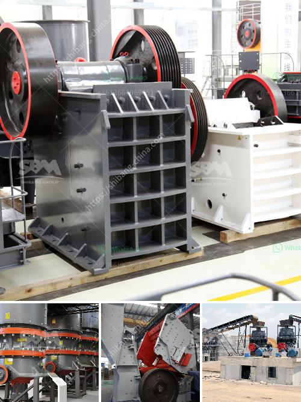

<h3>balance calculations in vertical roller mill</h3>
Balance calculations in vertical roller mills are critical for maintaining the desired production capacity and product quality. In order to analyze and optimize the process, it is essential to have a clear understanding of the mill’s balance calculations.

Vertical roller mills, or VRMs, are becoming increasingly popular in cement and raw material grinding due to their high energy efficiency, low noise and high drying capacity. However, these machines require careful balance calculations to ensure smooth operation and minimize the risk of damaging the equipment.

One important aspect of balance calculations in VRMs is the airflow through the mill. The airflow not only affects the efficiency of the grinding process, but also influences the product quality and the stability of the mill. In order to achieve the desired balance, the air velocity, pressure drop, and gas flow rate must be carefully calculated and adjusted.

Another critical factor in balance calculations is the feed rate. The feed rate determines the flow of material into the mill and directly impacts the mill’s production capacity. It is essential to accurately measure and adjust the feed rate to ensure a steady and balanced operation.

The material balance is also crucial in VRMs. The material balance accounts for the amount of material entering and leaving the mill, as well as the material inside the mill. By properly calculating and adjusting the material balance, it is possible to prevent overgrinding or undergrinding, which can have a significant impact on the product quality and energy consumption.

Additionally, the heat balance is an essential component of balance calculations in VRMs. The heat balance accounts for the heat generated during the grinding process, as well as the heat lost through the mill’s cooling system. Balancing the heat input and output is crucial to prevent excessive heat buildup and ensure efficient operation.

In order to perform accurate balance calculations, it is important to have reliable and precise measurement instruments and sensors. These instruments should be regularly calibrated and maintained to ensure their accuracy. By collecting and analyzing the measurement data, it becomes possible to optimize the balance calculations and improve the mill’s performance.

Furthermore, computer simulations and modeling techniques can be used to support the balance calculations in VRMs. These tools can provide valuable insights into the process and help identify potential areas for optimization. By simulating different operating conditions and scenarios, it becomes possible to fine-tune the balance calculations and achieve the desired performance targets.

In conclusion, balance calculations in vertical roller mills are crucial for maintaining the desired production capacity and product quality. By carefully analyzing and adjusting the airflow, feed rate, material balance, and heat balance, it is possible to optimize the mill’s performance and minimize the risk of damaging the equipment. Advanced measurement instruments, computer simulations, and modeling techniques can support the balance calculations and help achieve the desired results.
<h3>Contact us</h3><ul><li><strong>Whatsapp:&nbsp;<a href="https://wa.me/8613661969651">+8613661969651</a></strong></li><li><a href="https://swt.shibang-china.com/?git&amp;zhl&amp;balance calculations in vertical roller mill"><strong>Online Service(chat now)</strong></a></li></ul><h3>Related</h3><ul><li><a href='barite mining and quarry equipment spain.md'>barite mining and quarry equipment spain</a></li><li><a href='how the screw sand washing works.md'>how the screw sand washing works</a></li><li><a href='gold ore refinery portable machinery maker china.md'>gold ore refinery portable machinery maker china</a></li><li><a href='cement project cost in pakistan.md'>cement project cost in pakistan</a></li><li><a href='stone crusher plant.md'>stone crusher plant</a></li></ul>