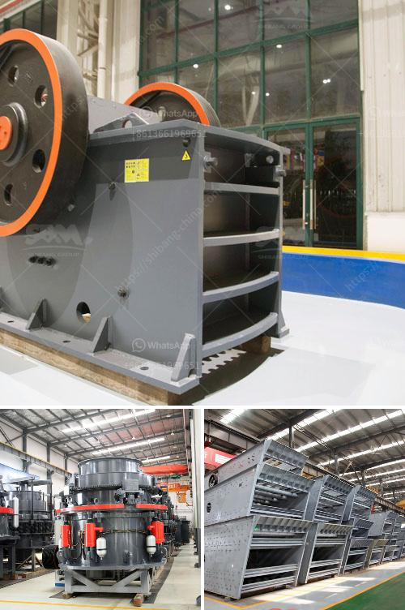

<h3>ball mill 100tph catalog</h3>
A ball mill is a type of grinding mill, which purpose is similar to the sag mill or other mining crushers. These machines are used to grind or mix metals or raw materials for further processing. Various materials are placed into the mill drum and rotated with the mined materials that are to be crushed. The ball mill contains materials meant for crushing and grinding, such as balls of ceramic, small rocks, or balls made from stainless steel. The internal device of the ball mill grinds material into powder-like substances, and can rotate continuously for optimal grinding and refinery production.

The ball mill has several categories depending on the shape of the cylinder (drum), cylindrical ball mill, and conical ball mill, among others. These different types of ball mills can enjoy different advantages depending on their applications.

When it comes to mining and construction, ball mills are immensely popular. In a mining site, miners knead rocks with ores to extract the metal or material they need. With the help of a ball mill, the extracted material is ground down to fine powder or even ultra-fine powder for subsequent processing, such as separating precious metals or focused grinding of ores.

In construction, the ball mill is mainly used to grind cement clinker in cement production process. This cement mill is widely used in the grinding of cement raw meal, cement clinker, slag, raw coal, and other raw materials. It also has several unique characteristics:

1. It is reliable and efficient. Compared with other cement grinding mills, its small floor space and lower noise level make it an ideal choice for construction sites.

2. It has a high grinding efficiency. The grinding media is evenly distributed in the cylinder due to the rotating drum, which enhances grinding efficiency.

The capacity of a ball mill can be determined by the size and quantity of grinding media. Typically, a ball mill has a capacity of 100 tph depending on the type, size, and quality of the grinding media. However, the ball mill itself has a relatively low capacity, especially when processed materials become more complex.

In conclusion, the ball mill is a versatile and efficient grinding machine that has found various applications in diverse industries. It can grind and mix materials for further processing, making it essential equipment in mining and construction. Furthermore, its simple operation, low maintenance, and high grinding efficiency make it a reliable choice for various production processes.
<h3>Contact us</h3><ul><li><strong>Whatsapp:&nbsp;<a href="https://wa.me/8613661969651">+8613661969651</a></strong></li><li><a href="https://swt.shibang-china.com/?git&amp;zhl&amp;ball mill 100tph catalog"><strong>Online Service(chat now)</strong></a></li></ul><h3>Related</h3><ul><li><a href='250tph grinding equipment price.md'>250tph grinding equipment price</a></li><li><a href='sand making crusher.md'>sand making crusher</a></li><li><a href='gypsum production line.md'>gypsum production line</a></li><li><a href='dicalcium phosphate production line.md'>dicalcium phosphate production line</a></li><li><a href='cara kerja mesin pemecah batu stone crusher.md'>cara kerja mesin pemecah batu stone crusher</a></li></ul>