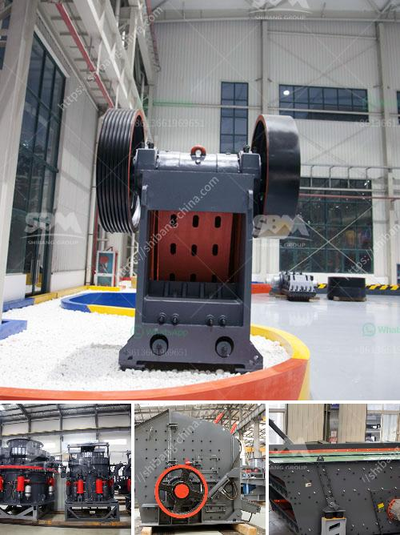

<h3>ball mill 25 tons per hour price</h3>
The ball mill is a commonly used grinding equipment in the beneficiation production line. It is the key equipment for crushing and grinding materials after crushing. This machine has a wide range of grinding and mineral processing applications, including cement, silicate products, new building materials, refractory materials, fertilizers, black and non-ferrous metal mineral processing and glass ceramics production industries.

The ball mill is composed of a horizontal cylinder, a hollow shaft for feeding and discharging materials, and a grinding head. The cylinder is a long cylinder. The cylinder is equipped with grinding media, which is made of steel balls, steel rods, ceramic balls, or ore pebbles. The steel balls or rods are placed in the cylinder according to a certain proportion, and the grinding media will constantly collide and grind the material inside the cylinder, thereby achieving the purpose of grinding.

The price of the ball mill is an important factor affecting the price of the entire grinding system. Because the weight and power consumption of the ball mill occupy a large proportion in the whole equipment cost, and the price of the ball mill with a larger capacity and more advanced technology will be higher, and the price of the ball mill with a smaller capacity and less advanced technology will be lower.

There are many factors affecting the price of ball mills, including model, technology, equipment quality, after-sales service, production capacity, etc. Among them, the large-scale ball mills used in the beneficiation production line usually have a price of more than 100,000 RMB. In the market, the price of small-scale ball mills usually ranges from tens of thousands to hundreds of thousands. Most of them are from 50,000 to 200,000 RMB. The specific price can be consulted by the manufacturer.

The ball mill consists of a metal cylinder and a ball. The working principle is that when the cylinder is rotated, the grinding body (ball) and the object to be polished (material) installed in the cylinder are rotated by the cylinder under the action of friction and centrifugal force. At a certain height, it will automatically fall and impact crushing the material inside.

The main advantages of the ball mill: simple structure, less investment and energy saving compared with similar equipment; the ball mill has light weight, low vibration, low noise, good starting performance, and no dust overflow during operation. It can be used in both wet and dry grinding.

In conclusion, the main factors affecting the price of the ball mill are: the model, the quality and the after-sales service. Since the ball mills are relatively expensive, the ball mill prices vary from batch to batch. They are generally in line with market demands, but their prices are generally not affected by the factors such as the cost of raw materials, labor, etc. Therefore, the ball mill price is mainly determined by the cost of production, market demand, competition, and other factors.
<h3>Contact us</h3><ul><li><strong>Whatsapp:&nbsp;<a href="https://wa.me/8613661969651">+8613661969651</a></strong></li><li><a href="https://swt.shibang-china.com/?git&amp;zhl&amp;ball mill 25 tons per hour price"><strong>Online Service(chat now)</strong></a></li></ul><h3>Related</h3><ul><li><a href='mini cement plant for sale in india.md'>mini cement plant for sale in india</a></li><li><a href='gold mining and washing machine usa.md'>gold mining and washing machine usa</a></li><li><a href='jaw crusher in china.md'>jaw crusher in china</a></li><li><a href='brick making machine for sale in south africa.md'>brick making machine for sale in south africa</a></li><li><a href='small rock crusher mining.md'>small rock crusher mining</a></li></ul>