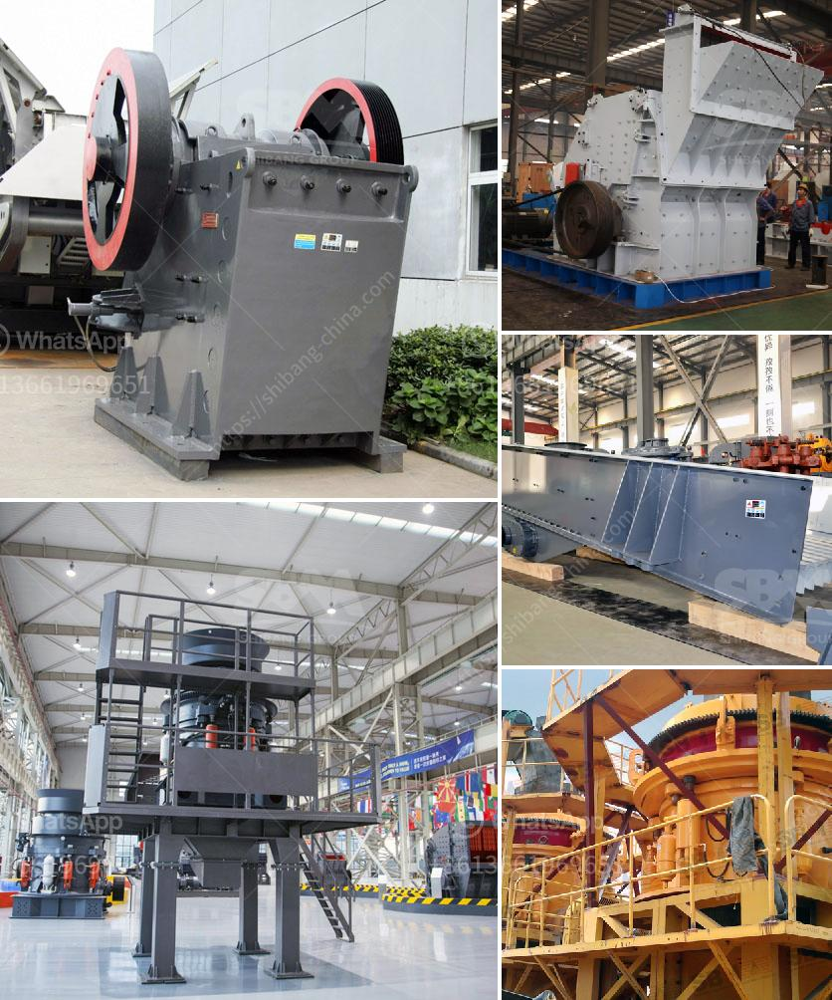

<h3>ball mill 3 ton</h3>
A ball mill is a necessary machine for mixing, fine grinding, and preparing small volume high-tech material production. Generally, small ball mills are used for research, laboratory and development purposes. In universities and colleges, these mills are typically deployed for metallurgical, chemical, and ceramic-related applications. Optimizing such mills in terms of energy consumption and process control plays an important role in achieving higher grinding efficiency and enhancing product quality.

One commonly used ball mill is a three-ton ball mill, which is an industry standard. It consists of a rotating drum filled with heavy balls that grind the material to a specific size. The grinding process is facilitated by the movement of the balls within the drum, which causes impact and friction forces to act on the material, resulting in particle size reduction.

The key feature of the three-ton ball mill is its ability to hold a large capacity of material to be ground. This makes it suitable for continuous operation, reducing the requirement for frequent refilling and thus increasing productivity. Moreover, its robust design ensures long-lasting performance and minimal maintenance.

The size of the ball mill is another important aspect to consider. A larger ball mill generally provides higher grinding efficiency, as it allows for more balls and material to be in motion, thereby increasing the impact and grinding forces involved. However, the size of the mill should be balanced with other factors such as energy consumption and the required product fineness.

To optimize the performance of a three-ton ball mill, several factors need to be considered. Firstly, the size and type of balls used should be carefully selected to maximize grinding efficiency. Additionally, the rotation speed of the drum should be adjusted to achieve the desired fineness while minimizing energy consumption. Modern ball mills often come with automated control systems that monitor and adjust these parameters, making the operation more efficient and reproducible.

Another important factor in ball mill performance is the material being ground. Different materials have different properties that can affect the grinding process. For example, some materials are more abrasive and require harder ball materials to minimize wear. Additionally, the moisture content and particle size distribution of the material can influence the grinding behavior, requiring adjustments in the operating parameters.

In summary, a three-ton ball mill is a crucial machine in many industrial sectors. Its ability to hold a large capacity of material, coupled with its robust design and optimized performance parameters, makes it an ideal choice for various applications. By carefully considering factors such as ball size, rotation speed, and material properties, the performance of the ball mill can be maximized, resulting in higher grinding efficiency and improved product quality.
<h3>Contact us</h3><ul><li><strong>Whatsapp:&nbsp;<a href="https://wa.me/8613661969651">+8613661969651</a></strong></li><li><a href="https://swt.shibang-china.com/?git&amp;zhl&amp;ball mill 3 ton"><strong>Online Service(chat now)</strong></a></li></ul><h3>Related</h3><ul><li><a href='quartz movement production process.md'>quartz movement production process</a></li><li><a href='barite processing plants in texas.md'>barite processing plants in texas</a></li><li><a href='construction of roller mill.md'>construction of roller mill</a></li><li><a href='crushing plant suppliers in pakistan.md'>crushing plant suppliers in pakistan</a></li><li><a href='crushing b series vsi crusher.md'>crushing b series vsi crusher</a></li></ul>