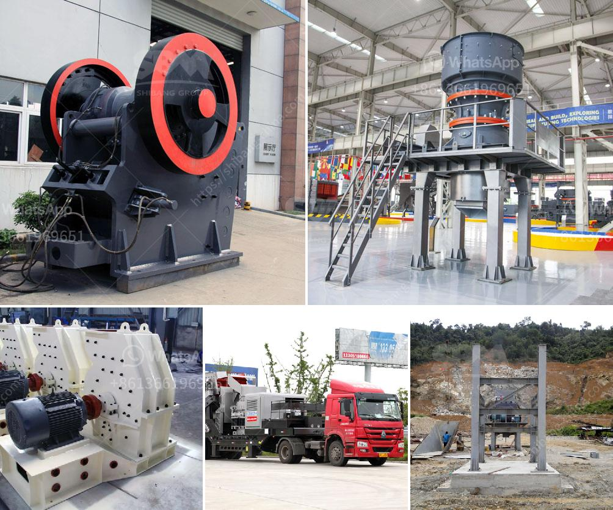

<h3>ball mill battery lead pdf</h3>
Ball mill battery lead is an essential component in the manufacturing of lead-acid batteries. This article aims to provide a comprehensive understanding of the process of ball mill battery lead manufacturing.

The manufacturing process of ball mill battery lead involves two stages: the melting and the milling. In the melting stage, the lead ingot is put into a melting furnace and a blast of hot air is applied to it. This results in the melting of the lead, which then flows into a holding kettle.

Once the lead is molten, it is poured into the ball mill casing, which consists of a rotating drum with heavy steel balls inside. The rotating action crushes the lead into a fine powder, resulting in a granular consistency. The powdered lead, known as lead oxide, is then sieved to remove any impurities.

The lead oxide is then mixed with water and sulfuric acid to form a paste. This paste is applied to a grid made of lead alloy, which acts as the positive electrode of the battery. The paste is carefully spread onto the grid to ensure an even distribution.

Once the paste is applied, the grid is dried and cured in an oven. This process allows the paste to harden and adhere firmly to the grid. The grid is then rolled to compact the paste and create a uniform surface.

The next step involves stacking the positive and negative grids, separated by a separator material, to form the battery plates. The plates are then assembled into the battery case, and the electrolyte, a mixture of sulfuric acid and water, is added.

The ball mill battery lead manufacturing process is complex but crucial for the production of high-quality lead-acid batteries. The process ensures the formation of a consistent, durable, and reliable battery plate, which is vital for the performance and longevity of the battery.

In conclusion, ball mill battery lead is an integral part of the manufacturing process of lead-acid batteries. This process involves melting the lead, milling it into a fine powder, mixing it with water and sulfuric acid to form a paste, applying the paste to grids, curing the grids, and assembling the battery plates. The ball mill battery lead manufacturing process ensures the production of reliable and long-lasting batteries.
<h3>Contact us</h3><ul><li><strong>Whatsapp:&nbsp;<a href="https://wa.me/8613661969651">+8613661969651</a></strong></li><li><a href="https://swt.shibang-china.com/?git&amp;zhl&amp;ball mill battery lead pdf"><strong>Online Service(chat now)</strong></a></li></ul><h3>Related</h3><ul><li><a href='mining equipment seller in asia.md'>mining equipment seller in asia</a></li><li><a href='diamond wash plants for sale in south africa.md'>diamond wash plants for sale in south africa</a></li><li><a href='crushing machine in quarry.md'>crushing machine in quarry</a></li><li><a href='crushing jaw crusher.md'>crushing jaw crusher</a></li><li><a href='barite grinding plant machine sale.md'>barite grinding plant machine sale</a></li></ul>