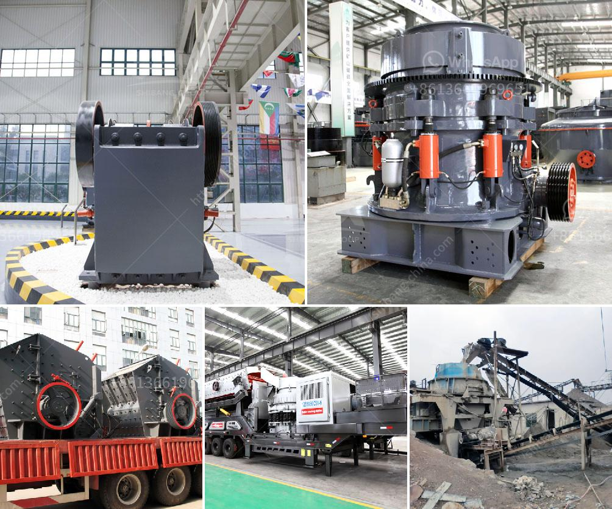

<h3>ball mill capacity 100 tph in gujarat</h3>
Ball mill capacity can be increased by a few factors, including the proper design of the ball mill, the size of the ball mill jars, and the speed of rotation. However, these factors cannot be implemented overnight, and this is the reason why a ball mill capacity 100 tph in Gujarat requires a thorough consultation with experts.

A ball mill is a type of grinder used to grind materials into extremely fine powder for use in mineral dressing processes, paints, pyrotechnics, ceramics, and selective laser sintering. It works on the principle of impact and attrition: size reduction is done by impact as the balls drop from near the top of the shell. A ball mill consists of a hollow cylindrical shell rotating about its axis. The axis of the shell may be either horizontal or at a small angle to the horizontal. It is partially filled with balls. The grinding media are the balls, which may be made of steel, stainless steel, ceramic, or rubber.

In Gujarat, many industries require a ball mill with capacity 100 tph. However, there are various factors that have led to the reduction in capacity of ball mills in the region. Gujarat is considered an industrial hub and the demand for materials and products in the state has increased significantly in recent years. This has resulted in more companies requiring larger capacity ball mills to meet the demand.

To overcome this issue, various strategies can be adopted. Increasing the size of the ball mill jars is one possible solution. This would allow for a larger volume of material to be processed at a time, increasing the overall capacity. Additionally, the speed of rotation can be adjusted to optimize the grinding process and increase the capacity.

Overall, increasing the ball mill capacity to 100 tph in Gujarat requires careful consideration and consultation with industry experts. Implementing the necessary changes may involve costs and modifications to the existing setup, but it is a worthwhile investment to meet the growing demand for materials and products in the region.
<h3>Contact us</h3><ul><li><strong>Whatsapp:&nbsp;<a href="https://wa.me/8613661969651">+8613661969651</a></strong></li><li><a href="https://swt.shibang-china.com/?git&amp;zhl&amp;ball mill capacity 100 tph in gujarat"><strong>Online Service(chat now)</strong></a></li></ul><h3>Related</h3><ul><li><a href='iron ore primarysecondary and tertiary crusher.md'>iron ore primarysecondary and tertiary crusher</a></li><li><a href='barite crusher price.md'>barite crusher price</a></li><li><a href='concrete cube crushing machine price.md'>concrete cube crushing machine price</a></li><li><a href='jaw crusher technical parameter.md'>jaw crusher technical parameter</a></li><li><a href='ball mill servicing agents south africa.md'>ball mill servicing agents south africa</a></li></ul>