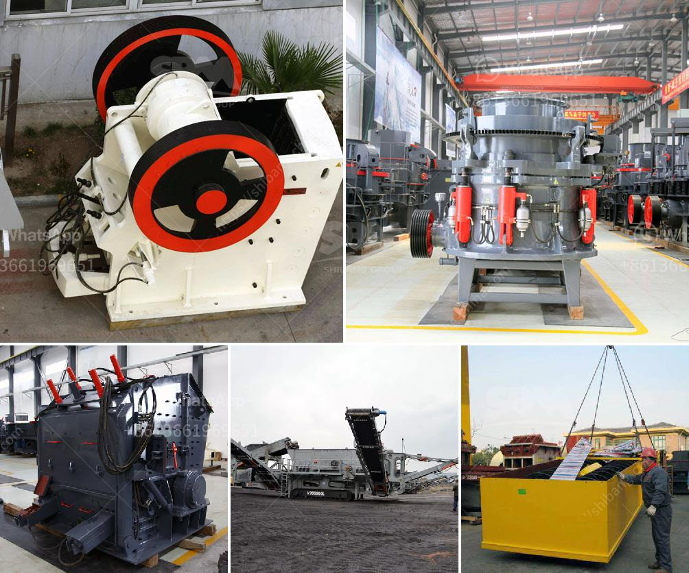

<h3>ball mill diagram manufacturers in bangalore</h3>
Ball mill diagram manufacturers in Bangalore offer top quality milling machines and machine tools for industrial and commercial applications. These manufacturers are known for their superior products that are designed to meet high standards of performance, reliability, and durability. With their expertise and experience, they provide the best solutions for various industries, including mining, chemical, construction, and more. In this article, we will discuss the ball mill diagram manufacturers in Bangalore and the benefits of using their products.

The ball mill is a key piece of equipment for grinding crushed materials, and it is widely used in production lines for powders such as cement, silicates, refractory material, fertilizer, glass ceramics, etc., as well as for ore dressing of both ferrous and non-ferrous metals. The ball mill can grind various ores and other materials either wet or dry. Bangalore's diagram manufacturers understand the need for such versatile equipment and deliver high-quality machines that are suitable for various applications.

When choosing a ball mill diagram manufacturer in Bangalore, it is important to consider their expertise in the field. The manufacturers should have a deep understanding of the milling process and its requirements. They should be able to provide comprehensive solutions that meet the specific needs of different industries. These manufacturers invest heavily in research and development to improve the design and performance of their products continuously. This ensures that their customers receive the latest advancements in milling technology.

In addition to expertise, the ball mill diagram manufacturers in Bangalore also prioritize the quality of their products. They use the finest materials and components to manufacture their machines, ensuring superior performance and long service life. These manufacturers follow strict quality control procedures throughout the manufacturing process to guarantee the highest level of precision and accuracy. Furthermore, they conduct thorough testing of each machine before it is dispatched to the customers, ensuring that it meets all the necessary specifications.

Another advantage of choosing ball mill diagram manufacturers in Bangalore is their commitment to customer satisfaction. These manufacturers have a team of skilled engineers and technicians who provide excellent after-sales support. They offer installation assistance and provide comprehensive technical training to ensure that their customers can operate the machines optimally. In case of any issues or queries, the manufacturers are readily available to provide prompt assistance and resolve any problems that may arise.

The manufacturers in Bangalore also offer flexible customization options to meet the specific needs of different clients. They have the capability to modify their machines as per the unique requirements of their customers. From changing the size and power of the ball mill to incorporating additional features, these manufacturers can tailor their products to suit any application. This flexibility ensures that customers get the right machine for their specific needs, enhancing productivity and efficiency.

To conclude, ball mill diagram manufacturers in Bangalore are trusted providers of top-quality milling machines and machine tools. Their expertise, commitment to quality, and customer-centric approach set them apart in the market. By choosing these manufacturers, industries can benefit from reliable and durable machines that deliver exceptional performance. Whether it is for grinding, mixing, or homogenizing, these manufacturers have the right solution for every milling requirement.
<h3>Contact us</h3><ul><li><strong>Whatsapp:&nbsp;<a href="https://wa.me/8613661969651">+8613661969651</a></strong></li><li><a href="https://swt.shibang-china.com/?git&amp;zhl&amp;ball mill diagram manufacturers in bangalore"><strong>Online Service(chat now)</strong></a></li></ul><h3>Related</h3><ul><li><a href='cocoa processing plant in nigeria.md'>cocoa processing plant in nigeria</a></li><li><a href='manufacturing of marble and granite crusher machines.md'>manufacturing of marble and granite crusher machines</a></li><li><a href='start up granite quarry crusher business.md'>start up granite quarry crusher business</a></li><li><a href='mining equipment cad blocks.md'>mining equipment cad blocks</a></li><li><a href='crusher dealers in cebu.md'>crusher dealers in cebu</a></li></ul>