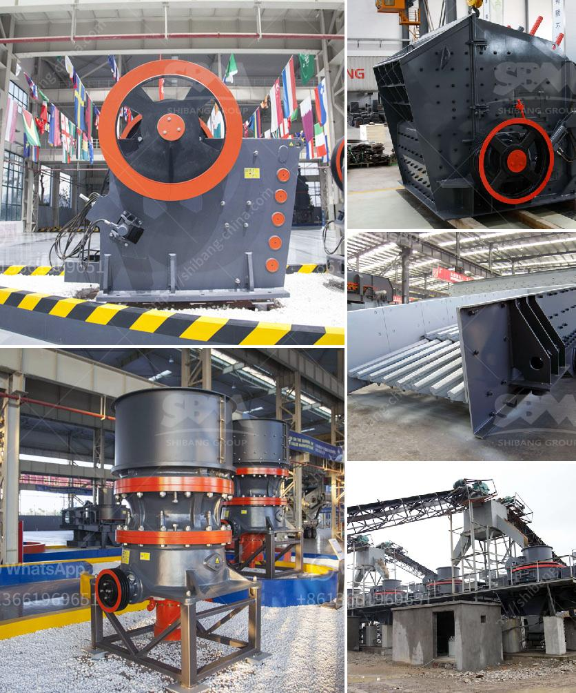

<h3>ball mill dry grinding 100mt hr capacity</h3>
A ball mill is a type of grinder used to grind materials into extremely fine powder for use in mineral dressing processes, paints, pyrotechnics, ceramics, and selective laser sintering. With its wide range of applications, ball mills are capable of grinding materials ranging from limestone to gold ore. In a ball mill, the grinding process is either wet or dry, depending on the mill’s capacity and the desired product size.

One of the key parameters that determine the capacity of a ball mill is the desired production rate. In the case of dry grinding, the grinding rate depends on the moisture content of the material, the size of the feed particles, and the hardness of the material. A ball mill with a dry grinding capacity of 100 mt/hr and a total load capacity of 40 mt is required to grind 200 mt/hr of limestone with a bulk density of 1.6 mt/m3. The maximum size of the feed should not exceed 80% of the required product size (d80).

To meet the capacity requirement, a ball mill of the same size as the specified mill should be chosen. The grinding media in this mill should be steel balls with a diameter of 50-70 mm. Under the given conditions, the grinding rate will be determined by the moisture content of the limestone, the size of the feed particles, and the hardness of the material.

In conclusion, a ball mill with a dry grinding capacity of 100 mt/hr and a total load capacity of 40 mt can be used to grind 200 mt/hr of limestone with a bulk density of 1.6 mt/m3. This requires a ball size distribution of 50-70 mm, which can withstand a maximum feed size of 80% of the required product size (d80). By considering these factors, the desired grinding capacity can be achieved efficiently and accurately.
<h3>Contact us</h3><ul><li><strong>Whatsapp:&nbsp;<a href="https://wa.me/8613661969651">+8613661969651</a></strong></li><li><a href="https://swt.shibang-china.com/?git&amp;zhl&amp;ball mill dry grinding 100mt hr capacity"><strong>Online Service(chat now)</strong></a></li></ul><h3>Related</h3><ul><li><a href='coal crusher machine indonesia supplier.md'>coal crusher machine indonesia supplier</a></li><li><a href='suplier jaw stone crusher nakayama in indonesia.md'>suplier jaw stone crusher nakayama in indonesia</a></li><li><a href='how to set up a crushing plant.md'>how to set up a crushing plant</a></li><li><a href='manganese ore jaw crusher south africa.md'>manganese ore jaw crusher south africa</a></li><li><a href='limestone process plant.md'>limestone process plant</a></li></ul>