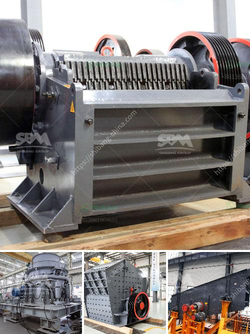

<h3>ball mill fly ash</h3>
Ball mill fly ash is a kind of artificial pozzolan that is formed from the combustion of pulverized coal in ball mill. The fly ash particles are obtained mostly from the flue gases, which is a result of the combustion process. This fly ash particles are generally used as a replacement for cement in the production of concrete.

The use of ball mill fly ash in cement and concrete has become more pronounced due to the increasing demand for sustainable construction materials. The manufacturing of cement requires a vast amount of natural resources such as limestone, clay, and fossil fuels. This has led to the depletion of these resources and the emission of greenhouse gases during the production process. Therefore, the use of fly ash as a partial replacement for cement is an effective way to reduce the environmental impact associated with cement manufacturing.

The ball mill fly ash is a fine powder that is produced as the result of the combustion of pulverized coal in ball mills. This fine powder is used as a raw material in cement production, concrete, and other construction materials. One of the major advantages of using this fly ash in cement and concrete is its highly reactive nature. The fine particles of fly ash react with the calcium hydroxide in cement to form calcium silicate hydrate (CSH), which is the main binder in concrete. This reaction enhances the strength and durability of the concrete, making it an ideal material for construction projects.

In addition to its reactive nature, ball mill fly ash has several other advantages. It significantly improves the workability and consistency of concrete, making it easier to handle and place. Due to its fine particle size, it fills in the voids between the cement particles, resulting in a denser and more compact concrete structure. This leads to improved durability and resistance to cracking, chemical attack, and abrasion. Furthermore, the use of fly ash in concrete reduces the heat of hydration, which is beneficial in controlling the temperature rise during the curing process.

Moreover, the use of ball mill fly ash in concrete also has environmental benefits. By using fly ash as a cement replacement, the demand for cement is reduced, thereby reducing the consumption of natural resources and the emission of carbon dioxide. This helps to mitigate climate change and promote sustainable development. Additionally, fly ash is a waste product that is generated in large quantities by coal-fired power plants. By utilizing this waste product, it reduces the need for landfill space and promotes resource efficiency.

In conclusion, ball mill fly ash is a versatile and beneficial material for cement and concrete production. Its highly reactive nature and advantageous properties make it an ideal alternative to cement, resulting in improved strength, durability, workability, and environmental performance. The use of fly ash in concrete not only reduces the environmental impact associated with cement manufacturing but also helps in the sustainable management of waste products. The utilization of ball mill fly ash promotes resource efficiency and contributes to the development of a green and eco-friendly construction industry.
<h3>Contact us</h3><ul><li><strong>Whatsapp:&nbsp;<a href="https://wa.me/8613661969651">+8613661969651</a></strong></li><li><a href="https://swt.shibang-china.com/?git&amp;zhl&amp;ball mill fly ash"><strong>Online Service(chat now)</strong></a></li></ul><h3>Related</h3><ul><li><a href='clinker grinding mill machine germany.md'>clinker grinding mill machine germany</a></li><li><a href='crushing and mining equipment companies in uae.md'>crushing and mining equipment companies in uae</a></li><li><a href='gypsum board connection machine.md'>gypsum board connection machine</a></li><li><a href='raymond mill operation.md'>raymond mill operation</a></li><li><a href='cement production equipment in germany.md'>cement production equipment in germany</a></li></ul>