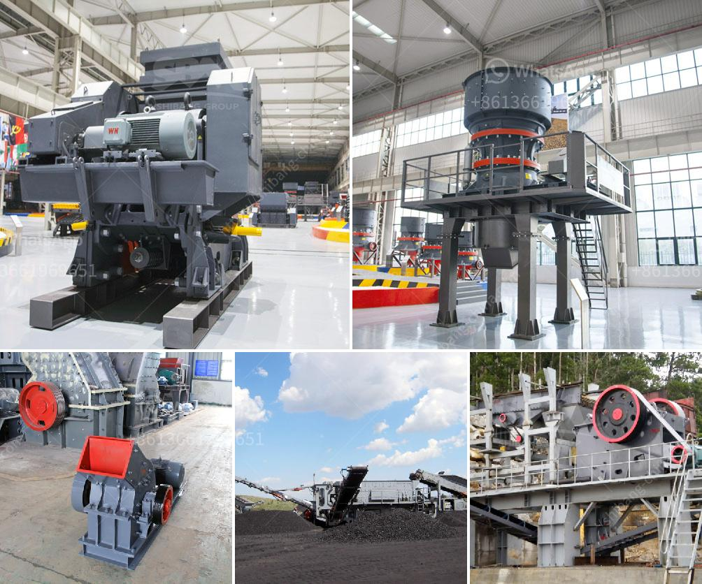

<h3>ball mill for lead processing companies list</h3>
A ball mill is a type of grinder used to grind, blend, and sometimes for mixing of materials for use in mineral dressing processes, paints, pyrotechnics, ceramics, and selective laser sintering. It works on the principle of impact and attrition: size reduction is done by impact as the balls drop from near the top of the shell. A ball mill consists of a hollow cylindrical shell rotating about its axis. The axis of the shell may be either horizontal or at a small angle to the horizontal. It is partially filled with balls. The grinding media are the balls, which may be made of steel, stainless steel, ceramic, or rubber.

Lead processing companies list includes several prestigious names involved in the lead industry. These companies are engaged in various aspects of lead processing, including mining, smelting, refining, and recycling. Ball mills are essential equipment for lead processing companies, as they grind the ore to create a finely ground product for separation and further treatment.

1. Eco-Bat Technologies Ltd: British company specializing in lead-acid battery recycling. Their refining processes require the use of a ball mill.

2. Doe Run: A Missouri-based mining company that operates the world's largest primary lead smelter and refinery. Ball mills play a key role in the production of powdered lead components necessary for batteries, ammunition, and glass additives.

3. Gravita India Ltd: A leading Indian company specializing in recycling lead. Their ball mills are used for the production of Red Lead, which is the raw material for the automotive battery industry.

4. Exide Technologies: An American company that produces and recycles lead-acid batteries. They utilize ball mills during the manufacturing process to mix and grind ingredients for the battery paste before casting into battery grids.

5. PENOX Group: Based in Germany, PENOX is a producer of various lead-based products used in industrial applications. They rely on ball mills for the production of lead oxide, used in lead-acid batteries and other purposes.

In conclusion, ball mills are crucial equipment for lead processing companies. The listed companies utilize ball mills in various lead processing applications, including refining, recycling, and the production of lead-based products.
<h3>Contact us</h3><ul><li><strong>Whatsapp:&nbsp;<a href="https://wa.me/8613661969651">+8613661969651</a></strong></li><li><a href="https://swt.shibang-china.com/?git&amp;zhl&amp;ball mill for lead processing companies list"><strong>Online Service(chat now)</strong></a></li></ul><h3>Related</h3><ul><li><a href='crusher 50 ton per hour price.md'>crusher 50 ton per hour price</a></li><li><a href='used aggregate crusher for sale in india.md'>used aggregate crusher for sale in india</a></li><li><a href='dolomite mining and processing.md'>dolomite mining and processing</a></li><li><a href='jaw crusher manufacturer in italy.md'>jaw crusher manufacturer in italy</a></li><li><a href='impact crushers for rent.md'>impact crushers for rent</a></li></ul>