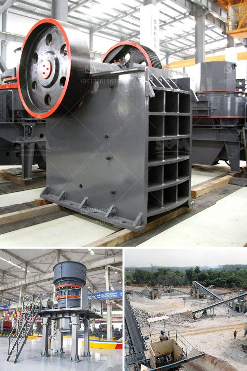

<h3>ball mill for sale in china</h3>
Ball mills are a fundamental part of the manufacturing industry in China, and play a vital role in the production of various products from paints, ceramics, and minerals to pharmaceuticals and building materials. These mills are extensively used in construction, mining, metallurgy, and chemical industries, thus making the Chinese ball mill market vibrant and active.

There are numerous types of ball mills available in the market, all of which differ in terms of their size, working principle, and external structure. While large ball mills are used for grinding bulk materials into fine powder, small-scale ball mills serve the purpose of laboratory testing.

China is the world's largest producer and consumer of steel, and a significant player in the mining and construction industries. With such a mammoth market demand, it is no surprise that China has an extensive range of ball mills for sale. From small-scale laboratory ball mills to large ones capable of handling thousands of tons of material per hour, China caters to all your grinding needs.

In addition to the size variations, China also offers ball mills with different working principles. While some mills operate on the principle of impact and attrition, others rely on the principle of attrition alone. In certain cases, mills utilize mechanical methods like compression or shearing as well.

When it comes to buying ball mills in China, there are two prominent options to consider – purchasing from a local supplier or finding a supplier online. Locally, ball mills can be bought in major cities or through specialized machinery stores. However, the convenience of online shopping and the ability to access a vast array of suppliers makes it a popular choice for many buyers.

In conclusion, ball mills are a crucial equipment in the manufacturing industry in China. With an extensive range of options available, they cater to various needs in different industries. Whether it is a small-scale laboratory ball mill or a large-scale industrial one, China has it all. So, if you are looking to buy a ball mill in China, you have plenty of options to choose from.
<h3>Contact us</h3><ul><li><strong>Whatsapp:&nbsp;<a href="https://wa.me/8613661969651">+8613661969651</a></strong></li><li><a href="https://swt.shibang-china.com/?git&amp;zhl&amp;ball mill for sale in china"><strong>Online Service(chat now)</strong></a></li></ul><h3>Related</h3><ul><li><a href='stone crusher powder which products in use in philippines.md'>stone crusher powder which products in use in philippines</a></li><li><a href='cost new jaw crusher.md'>cost new jaw crusher</a></li><li><a href='iron ore beneficiation process flow chart.md'>iron ore beneficiation process flow chart</a></li><li><a href='how much is a stone crusher.md'>how much is a stone crusher</a></li><li><a href='prices for ball mill in south africa.md'>prices for ball mill in south africa</a></li></ul>