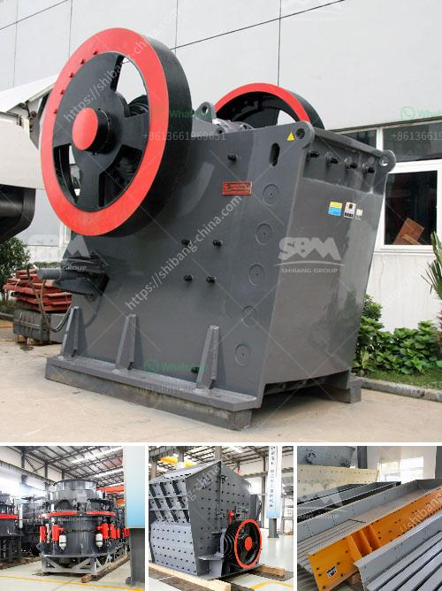

<h3>ball mill for silica powder</h3>
Ball mill is a critical equipment in the quartz sand production. In the processing of quartz sand for glass and ceramics industry, raw materials needed to avoid contamination by other substances, usually with silica liner or white alundum liner, grinding media also need to use White alundum ball or silica ball. Requirements of quartz powder specification in the industry is not uniform in general, the quartz sand, glass and ceramics production line, most of the requirements is 425 - 3250 mesh, while the production of some refined quartz powder, it is necessary to use ultrafine mill. However, the current domestic market, quartz powder processing is mainly processed by raymond mill, the use of high purity quartz sand processing. The capacity of raymond mill for silica powder with different size is available from 1.4-5 t/h.

Silica powder is also called quartz powder, it is hard and brittle nature, and there are different grades for silica powder for different industrial applications. Silica powder s the principal ingredient used in the production of glass, paper, ceramics, cement, silicon carbide, textiles, plastics, sealants, adhesives, cosmetics, medical devices, artificial quartz stone, calcite, marble, and other products. At present, the most widely used ultrafine mill in the market is the HX series vertical mill produced by HXJQ Machinery. It is mainly used for grinding of quartz, medical stone, calcium carbonate, potash feldspar, talc, marble, dolomite, limestone, and other materials.

The ball mill can be divided into dry ball mill and wet ball mill according to the material’ wet and dry grinding methods. The ball mill is normally used for grinding of ores, coal, pigments and other hard materials from the feed size of 3/4 inch to the average particle size of 20 microns. To achieve a reasonable efficiency with ball mills, they must be operated in a closed system, with oversize material continuously being recirculated back into the mill to be reduced. Various classifiers, such as screens, spiral classifiers, cyclones and air classifiers are used for classifying the discharge from ball mills.

Ball mill is an essential equipment in the production of high-purity quartz sand. It has the advantages of high-purity quartz sand production accuracy, acid resistance, high temperature resistance, excellent thermal shock resistance, et al. It is the foundation for the success of high-purity quartz sand products.

In the production process of quartz sand, the ball mill is mainly used for grinding operations. Generally, the grinding media of ball mill for quartz sand should be graded and its proportion should be controlled in a reasonable range. For the ceramic industry, the ball mill can be used for the grinding of quartz sand, granular materials and mixing of pulp materials. The ball mill body is spherical, which can be divided into cylindrical and conical. Different types of ball mill have different grinding effects. Different ball mill structures will have different grinding effects.

In the actual production of quartz sand, various operating parameters can be adjusted according to different mineral separation requirements, which greatly reduces the amount of quartz sand in the ball mill. When operating the ball mill, it is necessary to pay attention to the current and voltage fluctuations, so that the equipment can be well adjusted during use to address various unexpected situations in time. In addition, it is necessary to check the grinding media in the ball mill regularly and replace them in time to avoid affecting the normal production of the ball mill.
<h3>Contact us</h3><ul><li><strong>Whatsapp:&nbsp;<a href="https://wa.me/8613661969651">+8613661969651</a></strong></li><li><a href="https://swt.shibang-china.com/?git&amp;zhl&amp;ball mill for silica powder"><strong>Online Service(chat now)</strong></a></li></ul><h3>Related</h3><ul><li><a href='stone crusher jaw 40 ton jam harga.md'>stone crusher jaw 40 ton jam harga</a></li><li><a href='crusher for sale egypt.md'>crusher for sale egypt</a></li><li><a href='marble quarry mining in sudan.md'>marble quarry mining in sudan</a></li><li><a href='cameroon quarry crusher.md'>cameroon quarry crusher</a></li><li><a href='impact crusher equipment.md'>impact crusher equipment</a></li></ul>