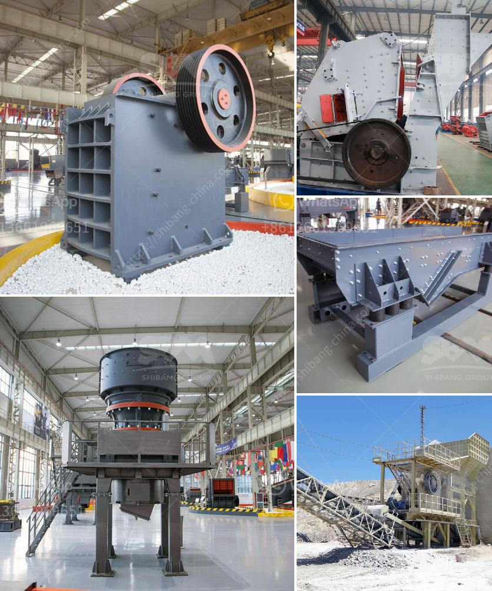

<h3>ball mill for size reduct</h3>
A ball mill is a type of grinder used to grind, blend, and sometimes for mixing of materials for use in mineral dressing processes, paints, pyrotechnics, ceramics, and selective laser sintering. It works on the principle of impact and attrition: size reduction is done by impact as the balls drop from near the top of the shell. A ball mill consists of a hollow cylindrical shell rotating about its axis. The axis of the shell may be either horizontal or at a small angle to the horizontal. It is partially filled with balls. The grinding media are the balls, which may be made of steel, stainless steel, ceramic, or rubber.

The ball mill is a key piece of equipment for grinding crushed materials, and it is widely used in production lines for powders such as cement, silicates, refractory material, fertilizer, glass ceramics, etc. as well as for ore dressing of ferrous and non-ferrous metals. The ball mill can grind ores and other materials either wet or dry.

Ball mills are commonly used in the manufacture of Portland cement and finer grinding stages of mineral processing. Industrial ball mills can be as large as 8.5 m (28 ft) in diameter with a 22 MW motor, drawing approximately 0.0011% of the total world's power. However, small versions of ball mills can be found in laboratories where they are used for grinding sample material for quality assurance.

The shape of the shell and the ratio of the diameter to the length of the shell vary from mill to mill. These mills are also capable of crushing materials during the size reduction process. Typically, this type of mill can produce a product with a relatively narrow particle size distribution.

A ball mill operates by rotating a cylinder with grinding balls like steel, CI, ceramic, or pebble balls as grinding media. Material fed through the mill is crushed by impact and grounded by attrition between the balls and the inner surface of the cylinder. The rotation of the cylinder causes material to be lifted up on the inner wall of the mill until it falls back on itself and the cycle is repeated. Ball mills have been successfully run at speeds between 60 and 90 percent of critical speed.

One of the operational parameters in ball mill grinding process is the particle size distribution. The particle size distribution, or the percentage of the feed with a specific size, can be controlled by adjusting the size of the grinding media. As the size of the grinding media increases, the impact process becomes less effective due to the reduced number of high-energy collisions. Conversely, efficient size reduction can be achieved by selecting smaller grinding media. The key is to manage the grinding media size to maximize the grinding process efficiency.

In summary, ball milling is a versatile technique that allows for the controlled size reduction of particles through grinding and impact. It can be used for both wet and dry milling, making it a suitable choice for a wide range of industries. From cement production to mineral processing, the benefits of ball milling are numerous and often significant. Whether used as a standalone process or as part of a larger operation, a ball mill can increase the efficiency and profitability of an organization by allowing for the effective size reduction of materials.
<h3>Contact us</h3><ul><li><strong>Whatsapp:&nbsp;<a href="https://wa.me/8613661969651">+8613661969651</a></strong></li><li><a href="https://swt.shibang-china.com/?git&amp;zhl&amp;ball mill for size reduct"><strong>Online Service(chat now)</strong></a></li></ul><h3>Related</h3><ul><li><a href='used carbon grinding production line.md'>used carbon grinding production line</a></li><li><a href='barite mining process with photos.md'>barite mining process with photos</a></li><li><a href='crushing and screening costs.md'>crushing and screening costs</a></li><li><a href='feasibility on quarry business.md'>feasibility on quarry business</a></li><li><a href='horizontal stone ball mill.md'>horizontal stone ball mill</a></li></ul>